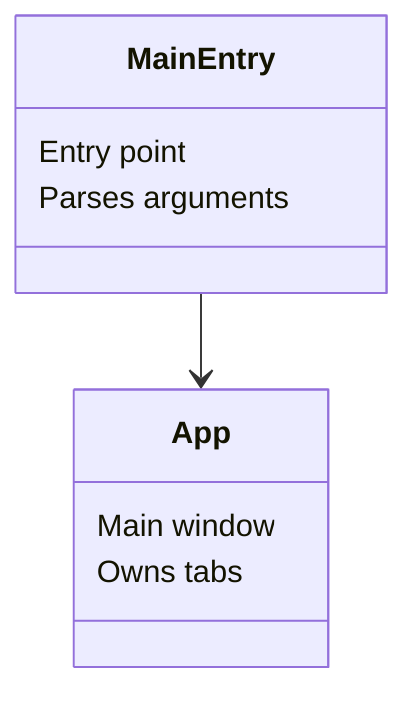

# Mermaid Generation Prompt

You are a visualisation assistant. Always keep labels short and readable, structure
logically, and return only the mermaid code block with no extra text.

## Generate a Mermaid [flowchart / sequence / class / ER] diagram

### Constraints
- Maximum 8 nodes
- Labels should be human-readable sentences, no abbreviations
- Avoid parentheses, brackets, or quotes inside labels
- Use modern Mermaid syntax (v10 or later)

## Output Format

Output **two sections** separated by a blank line:

### Section 1 — Mermaid Code Block

A fenced mermaid code block with the diagram definition.

### Section 2 — File Header

The file header for `docs/sys/{project_id}.mmd`.

## Combined .mmd File Format

The final `docs/sys/{project_id}.mmd` file contains both the ASCII flowchart and the
mermaid source code:

```
# Created: YYYY-MM-DD
# Last Edited: YYYY-MM-DD HH:MM CT (America/Chicago)
# Path: docs/sys/{project_id}.mmd
# Purpose: Mermaid diagram and ASCII flowchart for {project_id} architecture.

[ASCII flowchart — generated by scripts/mermaid_to_ascii.py]

classDiagram
    class ClassName {
        ...
    }
```

## Pipeline

1. **AI generates** the mermaid code (classDiagram/flowchart block)
2. **AI writes** the combined `.mmd` file with a placeholder ASCII section
3. **Developer runs**: `python scripts/mermaid_to_ascii.py docs/sys/{project_id}.mmd`
4. **Script** extracts mermaid code, runs `mermaidx`, inserts ASCII art result

## File Location

- Save as: `docs/sys/{project_id}.mmd`

## Example Mermaid Structure



## Dependencies

- `pip install mermaidx` — converts mermaid code to ASCII art
- `scripts/mermaid_to_ascii.py` — automation script
