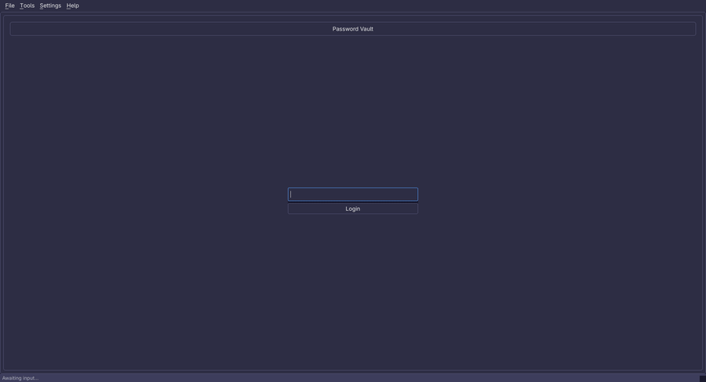
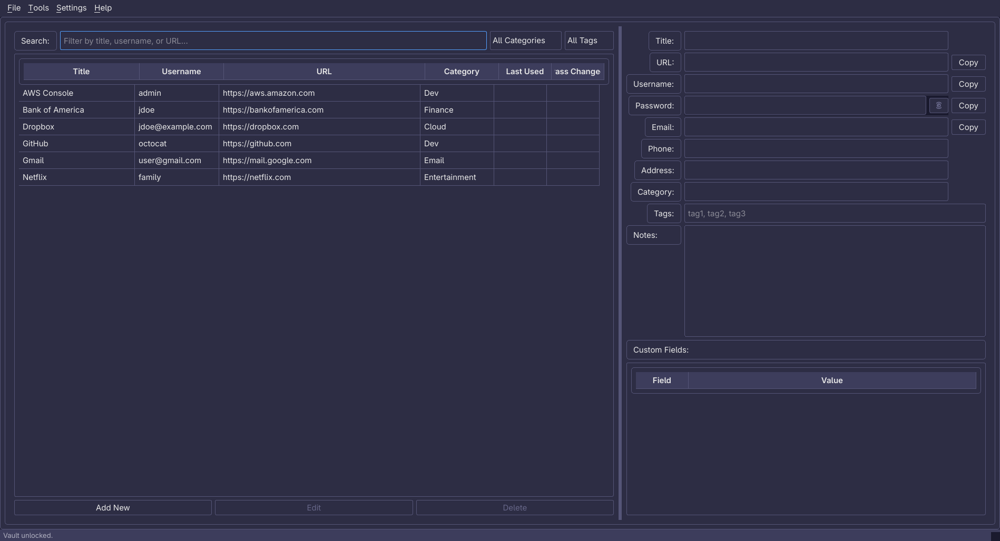
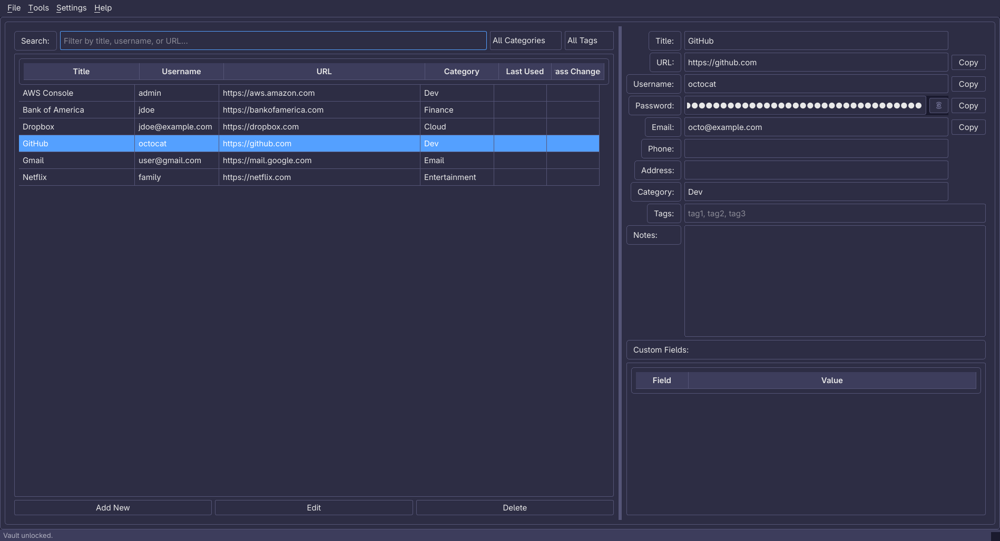
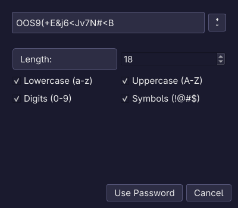
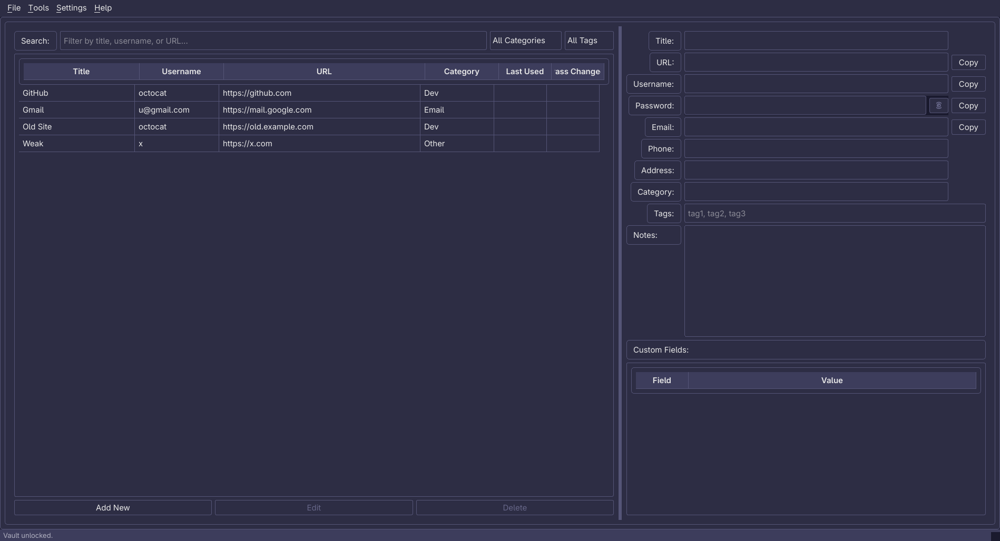

<pre align="center">
╔══════════════════════════════╗
║       A E T H E R V A U L T  ║
║   Encrypted Password Vault   ║
╚══════════════════════════════╝
</pre>

<h1 align="center">AetherVault</h1>

<p align="center">
  <em>Encrypted, local-first password manager</em>
  <br>
  Store, organize, and protect your credentials — encrypted with AES-256, right on your machine.
  <br>
  <strong><em>Your data stays yours. No cloud. No servers.</em></strong>
</p>

<p align="center">
  
  
  
  
  
  
  
  
</p>

---

## Screenshots









---

## Features

- **AES-256 encryption** — every password encrypted with Fernet (cryptography library), key derived with PBKDF2-SHA256
- **Master password auth** — setup/login flow; only the PBKDF2 hash is stored
- **Credential management** — add, edit, delete, search, sort, filter
- **Password generator** — configurable length and character sets
- **Password strength meter** — real-time scoring as you type
- **Password health report** — scan for weak, reused, or short passwords
- **Category & tag filters** — dynamic dropdowns, category click-to-filter
- **Custom fields** — key/value pairs on any entry (JSON-backed)
- **Rich text notes** — bold / italic / underline formatting toolbar
- **Favicon auto-fetch** — site icons pulled from Google's service
- **System tray** — minimize to tray, quick-lock from the tray menu
- **Dark / light theme** — toggle in Settings, persists across sessions
- **Auto-lock** — configurable 1/3/5/10/30 minutes or never
- **Duress password** *(optional)* — entering it at login permanently destroys the vault and all backups, indistinguishable from a failed login
- **Clipboard auto-clear** — copied passwords clear after 15 seconds
- **One-click backup** — timestamped filenames, auto-rotation keeps the 5 most recent
- **CSV import / export** — bulk add or migrate from other managers
- **Duplicate detection** — find and remove entries with matching title + username
- **Portable mode** — all data stays in the app directory (`.portable` marker)
- **Startup integrity check** — auto-detects corruption and recovers from backup

---

## Download a Pre-Built Executable

No Python or pip needed. Grab the binary for your platform from the
[Releases](https://github.com/AetherSolDev/AetherVault/releases) page
(or the latest [Actions build](https://github.com/AetherSolDev/AetherVault/actions) artifacts):

> Prefer a package manager? **`pip install aethervault-py`** (PyPI) works on Linux, macOS, and Windows.

| Platform | Download |
|----------|----------|
| Windows (x86_64) | [aethervault-windows-x86_64.exe](https://github.com/AetherSolDev/AetherVault/releases/latest/download/aethervault-windows-x86_64.exe) |
| Linux (x86_64) | [aethervault-linux-x86_64](https://github.com/AetherSolDev/AetherVault/releases/latest/download/aethervault-linux-x86_64) |
| macOS (Apple Silicon) | [AetherVault-arm64.dmg](https://github.com/AetherSolDev/AetherVault/releases/latest/download/AetherVault-arm64.dmg) |
| macOS (Intel) | [AetherVault-x86_64.dmg](https://github.com/AetherSolDev/AetherVault/releases/latest/download/AetherVault-x86_64.dmg) |

> The binaries are unsigned, so Windows SmartScreen and macOS Gatekeeper may warn on first run.
> Windows: click **More info → Run anyway**. macOS: right-click the .app → **Open** (or
> `xattr -dr com.apple.quarantine AetherVault.app`) if Gatekeeper blocks it.
> Linux: the binary expects standard Qt/X11 system libraries.
> **Executable installs** — to update, download the new binary from the
> [Releases](https://github.com/AetherSolDev/AetherVault/releases) page
> (`aethervault -u` requires a pip or git install and will not work inside a
> bundled executable).

---

## Quick Start

### Install

AetherVault is on **PyPI** (`aethervault-py`) and published to GitHub Releases on every version tag.

**Option 1 — pip (recommended, all platforms):**
```bash
pip install aethervault-py
# or
pip install --user aethervault-py
```

**Option 2 — Global install (editable):**
```bash
git clone https://github.com/AetherSolDev/AetherVault.git
cd AetherVault
pip install --user --break-system-packages -e .
```

**Option 3 — Virtual environment:**
```bash
git clone https://github.com/AetherSolDev/AetherVault.git
cd AetherVault
python -m venv venv
source venv/bin/activate   # Windows: venv\Scripts\activate
pip install -e .
```

**Option 4 — Build yourself (PyInstaller):**
```bash
pip install pyinstaller
pyinstaller aethervault.spec
# Output in dist/aethervault/
```

### Run

```bash
aethervault            # Launch GUI (auto-detaches from terminal on Unix)
aethervault --version  # Show installed version
aethervault --help     # CLI usage
```

---

## Usage

1. **First launch** — set a master password (minimum 8 characters)
2. **Login** — enter your master password to unlock the vault
3. **Add entries** — click "Add New" and fill in the form
4. **Generate passwords** — click "Generate" next to the password field
5. **Copy to clipboard** — double-click a table cell or click the "Copy" buttons
6. **Organize** — categories and tags group your entries
7. **Backup** — File → Backup Vault (or auto-backup on save/shutdown)

| CLI Command | Description |
|-------------|-------------|
| `aethervault` | Launch the GUI (auto-detaches on Unix) |
| `aethervault --version` | Show installed version |
| `aethervault --debug` | Launch with debug logging |
| `aethervault --upgrade` / `-u` | Check for updates and auto-upgrade (pip install aethervault-py) |
| `aethervault --foreground` / `-f` | Keep terminal attached (debugging) |

---

## Security

- Passwords are **never stored in plain text** — AES-256 via Fernet
- Master password is **never stored** — only its PBKDF2-SHA256 hash
- Encryption key derived from the master password hash (PBKDF2, 480K iterations)
- Clipboard **auto-cleared** after 15 seconds
- Auto-lock on **inactivity** or window focus loss
- SQLite with **parameterized queries** (no SQL injection)
- Startup **integrity check** with automatic recovery from backup
- Optional **duress password** — destroys the vault on coercion

---

## Data

| Data | Location |
|------|----------|
| Encrypted vault | `data/aethervault.db` |
| Master password hash | `data/.master.key` |
| App settings | `data/.app_settings.json` |
| Portable marker | `.portable` (enables portable mode) |

---

## Documentation

Full user guide: [`aethervault/docs/USER_GUIDE.md`](aethervault/docs/USER_GUIDE.md)

---

## License

[GPLv3](LICENSE) — Free as in freedom.
