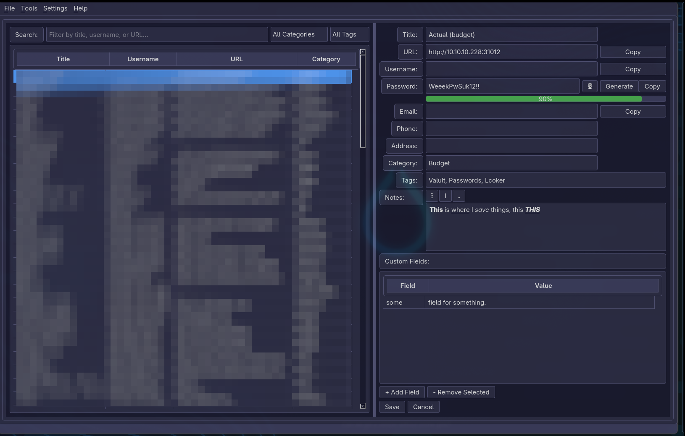

# AetherVault

A local, portable, encrypted password vault.

[](LICENSE)
[](https://www.python.org/)
[](https://pypi.org/project/PySide6/)
[]()
[](https://github.com/AetherSolDev/AetherVault/actions/workflows/build.yml)
[]()

---

## Overview

AetherVault is a desktop application that stores your credentials in an encrypted local SQLite database. No cloud, no servers, no subscriptions — your data stays on your machine, encrypted with AES-256.

### Features

- **AES-256 encryption** via Fernet (cryptography library), key derived with PBKDF2-SHA256 (480K iterations)
- **Master password** authentication with setup/login flow
- **Credential management** — add, edit, delete, search, sort, filter
- **Password generator** — configurable length (8–64), character sets
- **Password strength meter** — real-time scoring as you type
- **Password health report** — scan for weak, reused, or short passwords
- **Category & tag filters** — dynamic dropdowns, category click-to-filter
- **Custom fields** — add key/value pairs to any entry (JSON-backed)
- **Rich text notes** — bold/italic/underline formatting toolbar
- **Favicon auto-fetch** — downloads site icons from Google's service
- **System tray** — minimize to tray, quick-lock from tray menu
- **Dark/light theme** — toggle in Settings, persistent across sessions
- **Auto-lock** — configurable 1/3/5/10/30 minutes or never
- **Duress password** *(optional)* — entering it at login permanently destroys the vault and all backups, indistinguishable from a failed login
- **Clipboard auto-clear** — copied passwords clear after 15 seconds
- **One-click backup** — timestamped filenames, no confirmation dialog
- **CSV import/export** — bulk add or migrate data
- **Duplicate detection** — find and remove entries with matching title+username
- **Portable mode** — all data stays in the app directory (`.portable` marker)
- **Right-click context menu** — copy username/password, edit, delete
- **Sortable columns** — click Title/Username/Category to sort ascending/descending

## Screenshots



## Installation

### Option 1: Download a Pre-Built Executable (Recommended)

No Python or pip needed. Grab the binary for your platform from the
[Releases](https://github.com/AetherSolDev/AetherVault/releases) page
(or the latest [Actions build](https://github.com/AetherSolDev/AetherVault/actions) artifacts):

| Platform | Download |
|----------|----------|
| Windows (x86_64) | [aethervault-windows-x86_64.exe](https://github.com/AetherSolDev/AetherVault/releases/latest/download/aethervault-windows-x86_64.exe) |
| Linux (x86_64) | [aethervault-linux-x86_64](https://github.com/AetherSolDev/AetherVault/releases/latest/download/aethervault-linux-x86_64) |
| macOS (Apple Silicon) | [aethervault-macos-arm64](https://github.com/AetherSolDev/AetherVault/releases/latest/download/aethervault-macos-arm64) |
| macOS (Intel) | [aethervault-macos-x86_64](https://github.com/AetherSolDev/AetherVault/releases/latest/download/aethervault-macos-x86_64) |

> **macOS note:** the app is unsigned. On first launch, right-click the
> binary and select **Open** to bypass Gatekeeper.
> **Linux note:** the binary expects standard Qt/X11 system libraries.

### Option 2: Global Install (Editable)

Installs the `aethervault` command system-wide. Works in any directory.

```bash
git clone https://github.com/AetherSolDev/AetherVault.git
cd AetherVault

# Outside any virtual environment:
pip install --user --break-system-packages -e .

# Run from anywhere:
aethervault
```

### Option 3: Virtual Environment (Isolated)

```bash
git clone https://github.com/AetherSolDev/AetherVault.git
cd AetherVault

python -m venv venv
source venv/bin/activate   # Linux/macOS
# venv\Scripts\activate    # Windows

pip install -e .
aethervault
```

### Option 4: Build It Yourself (PyInstaller)

No Python or pip needed on the target machine.

```bash
pip install pyinstaller
pyinstaller aethervault.spec
# Output in dist/aethervault/

# Copy the dist/aethervault/ folder to any machine and run:
./aethervault
```

### CLI Reference

| Command | Description |
|---------|-------------|
| `aethervault` | Launch the GUI (auto-detaches from terminal on Unix) |
| `aethervault --version` | Show installed version |
| `aethervault --debug` | Launch with debug logging to terminal |
| `aethervault --upgrade` / `-u` | Check for updates and auto-upgrade via git pull or pip |
| `aethervault --foreground` / `-f` | Keep terminal attached (for debugging) |

## Usage

1. **First launch** — Set a master password (minimum 8 characters)
2. **Login** — Enter your master password to unlock the vault
3. **Add entries** — Click "Add New" and fill in the form
4. **Generate passwords** — Click "Generate" next to the password field
5. **Copy to clipboard** — Double-click a table cell or click "Copy" buttons
6. **Organize** — Use categories and tags to group entries
7. **Backup** — File → Backup Vault (or auto-backup on save/shutdown)

## Data Storage

| File | Purpose |
|------|---------|
| `data/aethervault.db` | Encrypted SQLite vault |
| `data/.master.key` | PBKDF2 hash of master password |
| `data/.app_settings.json` | Theme, auto-lock, and app preferences |
| `.portable` | Marker file for portable mode |

## Security

- Passwords are **never stored in plain text** — encrypted with AES-256 via Fernet
- Master password is **never stored** — only the PBKDF2-SHA256 hash (600K iterations)
- Encryption key is derived from the master password hash (480K iterations)
- Clipboard is **auto-cleared** after 15 seconds
- Auto-lock on **inactivity** or window focus loss
- SQLite with **parameterized queries** (no SQL injection)

## Documentation

Full user guide: [`docs/USER_GUIDE.md`](aethervault/docs/USER_GUIDE.md)
Technical reference: [`docs/sys/REFERENCE.html`](aethervault/docs/sys/REFERENCE.html)

## Project Structure

```
AetherVault/
├── aethervault/
│   ├── __init__.py              # Version, PROJECT_ROOT, portable mode
│   ├── core_logic.py            # Encryption, hashing, score_password, data model, settings
│   ├── db_manager.py            # SQLite CRUD, import/export/preview, backup, WAL
│   ├── __main__.py              # Entry point (--version, --debug, --upgrade, --foreground, auto-detach)
│   ├── assets/                  # App icon (aethersol.ico), logo, screenshots
│   ├── docs/
│   │   ├── USER_GUIDE.md        # User-facing documentation
│   │   ├── USER_GUIDE.html
│   │   └── sys/                 # PLAN, ARCHITECTURE, CHANGELOG, etc.
│   └── gui/
│       ├── app.py               # Main window coordinator
│       ├── click_to_copy_filter.py
│       ├── conflict_dialog.py   # Import conflict resolution
│       ├── credential_form.py   # Entry detail/edit form
│       ├── credential_table.py  # Credential list with search/filter
│       ├── dialogs.py           # Password generator, documentation viewer
│       ├── password_strength.py # Strength bar widget
│       └── theme.py             # Dark/light mode stylesheets
├── tests/                       # pytest test suite (69 tests)
│   ├── test_core_logic.py       # encryption, hashing, password gen, settings
│   ├── test_score_password.py   # password strength scoring
│   ├── test_credential_entry.py # data model
│   ├── test_db_manager.py       # CRUD, import/export, duplicates, backup, key guards
│   └── conftest.py
├── data/                        # Runtime data (gitignored)
│   ├── aethervault.db
│   ├── .master.key
│   └── .app_settings.json
├── MANIFEST.in                  # Package data for pip non-editable installs
├── pyproject.toml               # Package build config & CLI entry point
├── requirements.txt
└── aethervault.spec             # PyInstaller build spec
```

## Tech Stack

- **Python 3.12+** — core language
- **PySide6 (Qt)** — GUI framework
- **SQLite 3** — local database
- **cryptography** — Fernet AES-256 encryption
- **PBKDF2-SHA256** — key derivation (480K–600K iterations)

## License

GNU General Public License v3.0 — see [LICENSE](LICENSE)

## Contributing

Bug reports and feature requests are welcome via [GitHub Issues](https://github.com/AetherSolDev/AetherVault/issues).
