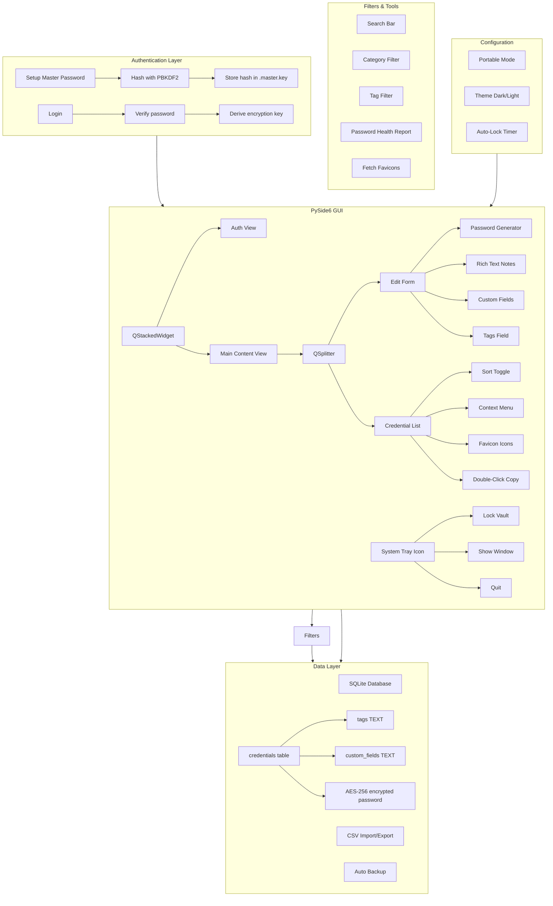
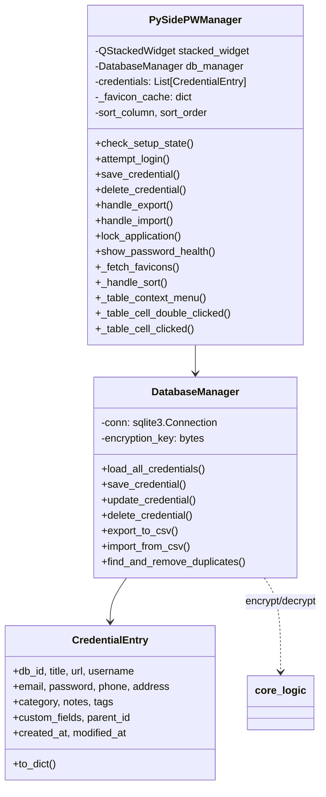
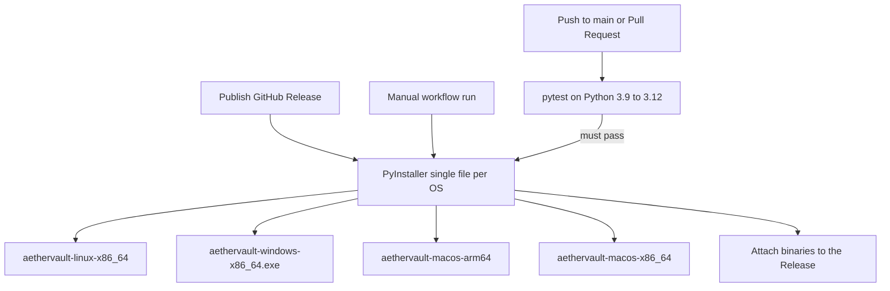

# docs — Technical Reference

> Auto-generated on 2026-08-01 02:30 CT from docs/sys/
> Source: `scripts/build_reference.py`

## Table of Contents

- [Architecture](#architecture)
- [Project Knowledge](#project-knowledge)
- [Project Plan](#project-plan)
- [Tasks](#tasks)
- [Changelog](#changelog)
- [Bug Tracker](#bug-tracker)
- [Development Costs](#development-costs)
- [Model Pricing Reference](#model-pricing-reference)
- [Diagram (aethervault)](#diagram-(aethervault))
- [Audit Report](#audit-report)

---

---

## Architecture

## Directory Structure
```
AetherVault/
├── .github/
│   └── workflows/
│       ├── build.yml            # Cross-platform exe builds + release asset upload
│       └── ci.yml               # pytest on push/PR (Python 3.9–3.12)
├── aethervault/
│   ├── __init__.py            # Package init, PROJECT_ROOT, VERSION, portable mode
│   ├── core_logic.py          # Encryption, hashing, score_password, CredentialEntry model, settings
│   ├── db_manager.py          # SQLite CRUD, import/export/preview/execute, backup, WAL mode
│   ├── __main__.py            # Application entry point (QApplication setup, auto-detach on Unix, --foreground)
│   ├── assets/                # App icon and screenshots
│   ├── docs/
│   │   ├── USER_GUIDE.md      # User-facing documentation
│   │   ├── USER_GUIDE.html
│   │   └── sys/               # System documentation
│   └── gui/
│       ├── __init__.py
│       ├── app.py             # PySidePWManager — coordinator (auth, menus, CRUD, import/export, tray)
│       ├── click_to_copy_filter.py  # ClickToCopyFilter event filter
│       ├── conflict_dialog.py       # ImportConflictDialog for per-entry conflict resolution
│       ├── credential_form.py       # CredentialForm — right panel (fields, notes, custom fields, save/cancel)
│       ├── credential_table.py      # CredentialTable — left panel (search, filters, table, context menu)
│       ├── dialogs.py         # PasswordGeneratorDialog, DocumentationDialog
│       ├── password_strength.py     # PasswordStrengthBar widget
│       └── theme.py           # Dark and light theme stylesheets
├── tests/
│   ├── __init__.py
│   ├── conftest.py            # Shared fixtures (temp_db, temp_db_no_key, sample_entry)
│   ├── test_core_logic.py     # Encryption, hashing, password gen, settings (24 tests)
│   ├── test_score_password.py # score_password unit tests (10 tests)
│   ├── test_credential_entry.py # CredentialEntry model (5 tests)
│   └── test_db_manager.py     # CRUD, import/export, duplicates, backup, key guards (22 tests)
├── data/                      # Runtime data (gitignored)
│   ├── aethervault.db         # Encrypted vault (SQLite)
│   ├── aethervault.db.bak     # Auto-backup
│   ├── .master.key            # Master password hash (PBKDF2)
│   └── .app_settings.json     # App settings (lockout, theme, etc.)
├── .gitignore
├── .repomixignore
├── pyproject.toml
├── requirements.txt
├── MANIFEST.in
└── aethervault.spec           # PyInstaller build spec
```

## Architecture Layers

### 1. Data Layer (`aethervault/core_logic.py`, `aethervault/db_manager.py`)
- SQLite database with AES-256 encrypted credential storage, WAL journal mode
- PBKDF2 key derivation from master password (600K iterations)
- Automatic timestamped backups + pre-op backups (backup before import/duplicate removal)
- CSV import with column alias mapping (73 aliases across 17 fields) + conflict preview/execute
- `__enter__`/`__exit__` context manager protocol

### 2. Coordinator (`aethervault/gui/app.py`)
- Authentication flow (setup master password → login → encryption key derivation)
- Clipboard management with auto-clear timer (15s) and form auto-clear on password copy
- Auto-lock on inactivity (configurable 1-30 min)
- Password generation (via PasswordGeneratorDialog)
- Duplicate detection via `db_manager.find_and_remove_duplicates()`
- System tray icon with quick-lock and minimize-to-tray
- Import/export/backup/restore with conflict resolution workflow
- Password health report (weak/reused/short scan)
- Theme toggle (light/dark)
- Portable mode detection

### 3. Presentation Layer (`aethervault/gui/`)
- **CredentialTable** — left panel: search, category/tag filters, sortable table, right-click context menu, favicon fetch
- **CredentialForm** — right panel: 8 editable fields, rich text notes, custom fields table, strength bar, save/cancel
- **ImportConflictDialog** — conflict review with per-entry radio buttons, bulk actions
- PySide6 (Qt) GUI with QStackedWidget for auth/main views
- QSplitter layout for list + form
- Dark/light themes

## Data Flow
```
User Input → PySidePWManager (app.py) → CredentialTable / CredentialForm
                                            ↓ signals
                                    PySidePWManager (coordinator)
                                            ↓
                                    DatabaseManager (db_manager.py) → SQLite
                                            ↓
                                    core_logic.py (AES-256 encrypt/decrypt)
```

## CI/CD Pipeline

```
Push to main / PR            → ci.yml → pytest (Python 3.9–3.12)     → gate
Publish Release / manual run → build.yml → PyInstaller onefile per OS →
    ├── ubuntu-latest   → aethervault-linux-x86_64
    ├── windows-latest  → aethervault-windows-x86_64.exe
    ├── macos-15-intel  → aethervault-macos-x86_64
    └── macos-latest    → aethervault-macos-arm64
                                            ↓ (on release: published)
                                    softprops/action-gh-release
                                            ↓
                        Assets attached to Release → /releases/latest/download
```

- `build.yml` requires `permissions: contents: write` so the `GITHUB_TOKEN` can upload release assets.
- The spec (`aethervault.spec`) is a shared single-file EXE build (no `COLLECT`); each OS produces one binary.
- Linux builds install Qt/X11 system deps (`libegl1`, `libgl1`, `libxcb-*`) so the xcb platform plugin is self-contained.
- macOS ships two binaries (arm64 + x86_64) because `cffi` has no universal2 wheel; the retired `macos-13` runner is replaced by `macos-15-intel`.

---

## Project Knowledge

> Read this first on session resume. Covers 80% of what you need to be
> productive without reading the full codebase. Updated every session.

---

## Architecture TL;DR

PySide6 desktop password manager. Single-window app with auth screen (setup/login)
and main split-pane view (credential list + edit form). SQLite backend with AES-256
encryption via `cryptography` library. Master password hashed with PBKDF2-SHA256.

## Critical Files Map

| File | Responsibility |
|------|---------------|
| `core_logic.py` | Encryption (Fernet/AES-256), password hashing, `score_password()`, `CredentialEntry` model, settings JSON I/O |
| `db_manager.py` | SQLite CRUD, CSV import/export/preview/execute, column alias mapping (73 aliases), `preview_import()`/`execute_import()`, duplicate removal, pre-op backup, WAL mode, context manager |
| `aethervault/gui/app.py` | PySidePWManager coordinator — auth flow, menus, CRUD orchestration, import/export/backup, system tray, auto-lock, clipboard, theme toggle, health report |
| `aethervault/gui/credential_table.py` | CredentialTable — left panel: search, category/tag filters, sortable table, double-click copy, context menu, favicon fetch |
| `aethervault/gui/credential_form.py` | CredentialForm — right panel: 8 editable fields, rich text notes, custom fields table, password strength bar, save/cancel |
| `aethervault/gui/conflict_dialog.py` | ImportConflictDialog — conflict review with per-entry radio buttons, bulk actions |
| `aethervault/gui/click_to_copy_filter.py` | ClickToCopyFilter event filter |
| `aethervault/gui/password_strength.py` | PasswordStrengthBar widget (uses `score_password()`) |
| `aethervault/gui/dialogs.py` | PasswordGeneratorDialog, DocumentationDialog |
| `aethervault/gui/theme.py` | Dark/light mode stylesheets, QPalette |
| `aethervault/main.py` | QApplication entry point (auto-detach, --foreground flag) |
| `tests/` | 69 pytest tests across 5 files + shared fixtures |
| `docs/USER_GUIDE.md` | User-facing documentation (opened from Help menu) |
| `aethervault.spec` | PyInstaller spec for building standalone executables |
| `.github/workflows/build.yml` | CI builds + release-uploads single-file exe for Win/Linux/macOS (Intel + ARM) |
| `.github/workflows/ci.yml` | Runs 61 pytest tests on push/PR across Python 3.9–3.12 |

## Key Decisions

| Decision | Rationale |
|----------|-----------|
| PySide6 (Qt) over Tkinter | Mature widget set, cross-platform, professional look |
| SQLite + AES-256 | Portable single-file vault, no server needed |
| PBKDF2 (600K iterations) | Industry-standard key derivation, OWASP recommended |
| QStackedWidget for views | Reliable view swapping between auth and main content |
| Single monolithic file | Legacy decision — scheduled for refactor into src/ package |

## Gotchas

- `WindowDeactivate` now resets activity timer (does NOT immediately lock) — fixed in session 4
- `sectionClicked` sort signal connected once in `create_main_content`, not on every `update_list_view`
- Password strength bar row is tracked independently via `row` counter to avoid grid cell collision
- Custom fields stored as JSON array of `{"field": "...", "value": "..."}` objects in `custom_fields` TEXT column
- Tags stored as comma-separated string in `tags` TEXT column — both columns auto-migrated on startup
- `handle_backup()` uses `get_timestamped_backup_path()` for unique filenames, shows success in status bar (no dialog)
- `.master.key` stores the hash, not the raw password — safe, but file deletion = permanent lockout
- Virtual env: `venv/` is a symlink → `kiss/`; both names resolve
- Portable mode: create `.portable` file in app directory to keep all data local
- System tray: close minimizes to tray; use File → Quit or tray → Quit to fully exit
- Auto-detach: `main.py` forks on Unix — parent exits, child runs GUI. Debug output goes to `/dev/null`. Use `--foreground` / `-f` to keep terminal attached
- Tag reminder: after bumping version in code, always `git tag -a vX.Y.Z && git push origin vX.Y.Z` — the upgrade check (`--upgrade`) reads GitHub tags, not committed code
- **Pre-op backups write to `data/`** (from `get_timestamped_backup_path()`), which is gitignored and empty on CI. `create_pre_op_backup()` now `os.makedirs()`es the dir first — don't "optimize" it back out
- **`aethervault.spec` must stay tracked** — it was gitignored and CI builds failed with "Spec file not found". If a PyInstaller spec is ever needed, commit it
- **`gh release create vX.Y.Z` reuses an existing local tag** — if a tag already exists (e.g., created days earlier), the release points at that old commit and the release build uses the OLD workflow/spec. Always verify `git rev-parse vX.Y.Z^{commit}` matches intended HEAD before releasing
- **macOS runners (2026-07)**: `macos-13` is retired (jobs queue forever). Use `macos-15-intel` (x86_64) and `macos-latest` (arm64). `universal2` builds fail because `cffi` has no fat wheel — build separate arch binaries instead
- **Ubuntu 24.04 runners**: `libgl1-mesa-glx` no longer exists; use `libgl1` + `libxkbcommon-x11-0` and bundle `libxcb-icccm4`/`libxcb-keysyms1`/`libxcb-shape0` so Qt's xcb platform plugin is self-contained

## Code Patterns

- Database methods use `try/except` with `error_handler` callback (lambda wiring to QMessageBox)
- All passwords encrypted at rest, decrypted in memory during session
- `CredentialEntry.to_dict()` used for serialization
- `row_factory = sqlite3.Row` for named column access
- Lambda closures with default args for button callbacks: `lambda checked, entry=line_edit: ...`

## Namespace Collision Lesson

**Never name your top-level package `src/`.** If you have multiple projects on
the same machine (AetherVault + AetherPod), their editable installs all register
`src` as a Python package — whichever was installed last wins.

**Fix:** Rename `src/` → `{project_name}/` from the start. Update all imports
from `from src.xxx` → `from aethervault.xxx`.

AetherVault was renamed from `src/` → `aethervault/` in v6.1.2 after hitting
this exact bug. Don't repeat it.

## Deployment & Packaging

| Task | Command |
|------|---------|
| Global install | `pip install --user --break-system-packages -e .` |
| Version bump | `aethervault/__init__.py` + `pyproject.toml` → `git tag -a vX.Y.Z` → `git push --tags` |
| Upgrade check | `aethervault/main.py` fetches latest tag from GitHub API |
| PyInstaller build (local) | `pyinstaller aethervault.spec` → `dist/aethervault` (single file) |
| CI build (all platforms) | Push to `main`, then Actions → Build → "Run workflow" (`workflow_dispatch`), or publish a Release |
| Publish a Release with binaries | `gh release create vX.Y.Z --generate-notes` → `build.yml` auto-attaches 4 executables on `release: published` |
| Data files location | `aethervault/docs/`, `aethervault/assets/` (inside package for pip compat) |

**Key rule:** Data files must live inside `aethervault/` to survive a non-editable pip install.

## Navigation Hints

- **Need to change encryption?** → `core_logic.py` (encrypt_data, decrypt_data, derive_encryption_key, score_password)
- **Need to add a DB operation?** → `db_manager.py` (DatabaseManager class)
- **Need to change the credential table?** → `aethervault/gui/credential_table.py` (CredentialTable class)
- **Need to change the edit form?** → `aethervault/gui/credential_form.py` (CredentialForm class)
- **Need to change import conflict behavior?** → `aethervault/gui/conflict_dialog.py`, `db_manager.py` (preview_import, execute_import)
- **Need to add a menu item?** → `aethervault/gui/app.py` (_build_file_menu, _build_tools_menu, etc.)
- **Need to change backup behavior?** → `db_manager.py` (create_pre_op_backup, _auto_backup_db)
- **Need to run tests?** → `venv/bin/python -m pytest tests/ -v`

## Future Features

| Feature | Status | Notes |
|---------|--------|-------|
| **vCard export** | planned | `File > Export Contacts (vCard)` — filter entries with non-empty phone/address, write `.vcf` (vCard 3.0). Covers 99% of real use. hCard/meCard not worth implementing. See session 2026-07-27 for full analysis. |

## Session History Summary

- **2026-07-24 (session 1)**: Initial project audit. Set up project scaffolding with New_Project_init template system. Created AGENTS.md, docs/sys/, USER_GUIDE.md, instructions/, scripts/, .repomixignore. Identified 3 bugs and 5 planned changes.
- **2026-07-24 (session 2)**: Fixed F0 (missing sys import), F1 (backup call order), F2 (assets dir). Refactored monolithic main_app_pyside.py (~1250 lines) into src/ package (7 files). Added dark/light theme support. Updated PyInstaller spec, .gitignore, requirements.txt.
- **2026-07-24 (session 3)**: Added system tray icon with quick-lock (A2). Added portable mode detection (A3). Created venv/ symlink (C3).
- **2026-07-24 (session 4)**: Category+tag filters, password health report, entry tags, custom fields, sort toggle, double-click copy, context menu, click-to-filter, favicon fetch, rich text notes, one-click backup. Fixed auto-lock timer bypass, strength bar grid collision, quit-to-tray bug, header clipping, RuntimeWarning. UI polish: QComboBox height matching, right-aligned labels, proportional form stretching, splitter sizing.
- **2026-07-24 (session 5)**: Added docstrings to all 129 modules/classes/functions. GitHub Actions CI for Win+macOS builds. Help opens in browser. Cleaned up `.gitignore` and untracked `AGENTS.md`, `aetherlock.spec`, `.repomixignore`, `venv`.
- **2026-07-25 (session 6)**: Renamed project from AetherLock to AetherVault to align with GitHub repo name. Created `pyproject.toml` for `pip install -e .` with CLI entry point `aethervault`. Updated all 30+ files with correct naming. Rebuilt REFERENCE docs. Installed system-wide via `pip install --user --break-system-packages -e .`.
- **2026-07-26 (session 7)**: Removed COST.md and KNOWLEDGE.md from git tracking (local-only). Updated all docs to reference `src/data/aethervault.db`. Added README screenshot `assets/main.png`. Cleaned stale files. Pushed to GitHub.
- **2026-07-27 (session 8)**: God file split — `app.py` 1627→968 lines, 4 new extracted files. Version 6.0.0→6.1.0. Added `time_last_used`/`time_password_changed` columns. CSV import with column alias system (73 aliases). Full audit (12/12 findings resolved). `score_password()` extracted, test suite (22 tests). WAL mode, context manager, conflict import dialog, logging instead of print. Documentation: AUDIT_REPORT.md, versioning criteria in AGENTS.md, safety.md fixes (NAS mount check, trash dir, .zshrc guards).
- **2026-07-27 (session 9)**: Import conflict resolution dialog + preview/execute workflow. `src/`→`aethervault/` rename to fix namespace collision between sibling projects. Packaging: docs/assets into `aethervault/`, MANIFEST.in, data-files, README updates. CLI switches (`--version`, `--debug`, `--upgrade`). Template updates to `New_Project_init` (packaging.md, namespace rule in audit checklist and cleanup patterns). Version 6.1.2. Cost: ~$0.35 for this session.
- **2026-07-27 (session 10)**: Auto-detach from terminal on Unix (`os.fork()` + `os.setsid()`). Added `--foreground` / `-f` flag to keep terminal attached for debugging. Updated CLI reference in README and USER_GUIDE. Version 6.2.0.
- **2026-07-27 (session 11)**: Encryption key guard on all import methods (`import_from_csv`, `execute_import`, `preview_import`). Simplified duplicate removal SQL to fix Python 3.14 transaction error. Added 39 tests: `test_core_logic.py` (encryption, hashing, password generation, settings) + extended `test_db_manager.py` (import/export, duplicates, backup, key guards). Updated README, ARCHITECTURE, KNOWLEDGE, USER_GUIDE paths. Test suite: 22→61. Version 6.2.1.
- **2026-07-27 (session 12)**: `--upgrade`/`-u` now auto-performs the upgrade (subprocess git pull + pip install -e . for cloned repos, pip install --upgrade for pip installs). Removed `_print_upgrade_instructions()`, added `_perform_upgrade()` and `_get_pip_command()`. Set `GIT_DISCOVERY_ACROSS_FILESYSTEM=1` in subprocess env for cross-filesystem git discovery. Fixed `.gitignore` to cover `src/data/`. No version bump.
- **2026-07-27 (session 13)**: Re-audit against alignment checklist — 42/42 checks pass, score A. All 12 prior findings still closed. No new issues. Reinstalled package system-wide. Updated all file timestamps to 16:51 CT.
- **2026-07-27 (session 14)**: Fixed `build.yml` workflow (stale `src/main.py` → `aethervault.spec`, added Linux build target). Created `ci.yml` — runs 61 pytest tests on push/PR across Python 3.9-3.12.
- **2026-07-30 (session 15)**: Cross-platform CI/CD delivery. Fixed CI failure (pre-op backup now creates `src/data/` dir). Committed `aethervault.spec` (was gitignored). Reworked `build.yml` — Ubuntu 24.04 Qt/xcb deps, `macos-13`→`macos-15-intel`, separate arm64+x86_64 macOS builds (cffi has no fat wheel), release asset upload. Published v6.2.1 release with 4 binaries; moved stale v6.2.1 tag to current HEAD. README: download table + build badge, fixed image/docs links, removed stray `# test` lines. Removed `safety.md`. Cleaned 9 stale Actions runs. 10 commits, no version bump.
- **2026-08-01 (session 16)**: Audit re-run (score A− → A). Removed all unused imports (AST-verified, zero remaining). Narrowed all 22 `except Exception` blocks to specific types (OSError, ValueError, TypeError, csv.Error, shutil.Error, sqlite3.Error, InvalidToken, RuntimeError). Added `InvalidToken` import to `core_logic.py`, `csv` import to `gui/app.py`. 61 tests pass, no version bump.
- **2026-08-01 (session 17)**: **Repo moved** to `git@github.com:AetherSolDev/AetherVault.git`. Updated remote + all URL refs (`__main__.py` GITHUB_TAGS_API/GIT_REPO_URL/RELEASES_URL, README badges/links, USER_GUIDE.md/html). Workflows already cover all platforms. Marked transfer done in PRE_PUBLIC_CLEANUP.md.
- **2026-08-01 (session 18)**: **Entry point cleanup** — `aethervault/main.py` → `aethervault/__main__.py` (run via `python -m aethervault`), removed root `aethervault.py` shim, fixed pyproject package-data (`src/` → `aethervault/`), updated MANIFEST.in + spec + global install. Reinstalled system-wide; 61 tests pass.
- **2026-08-01 (session 19)**: **Removed `src/`** — moved runtime data `src/data/` → root `data/` (`DATA_DIR = PROJECT_ROOT/data`), deleted stale `aethervault/data/`. Updated .gitignore + docs. Live vault preserved (429 creds).
- **2026-08-01 (session 20)**: **Duress password** (optional) — entered at login → cryptographically wipes vault + backups (`wipe_vault()` in core_logic). Keys deleted first (crypto erasure), then random-overwrite + delete all DB/WAL/SHM/.bak/settings. Fake "Invalid password" dialog then silent exit. Stored as PBKDF2 hash in `data/.duress.key`; checked first with identical cost (no timing tell). Settings → Duress Password to set/clear (needs master pw). Also added `rotate_backups()` (keeps 5 `.bak`). 8 new tests (69 total). Verified live against an isolated copy of the real vault — wipe destroyed all files, real vault (429 creds) untouched. **Released as v6.3.0.**

---

## Project Plan

# AetherVault Plan

## Legend
- C = Changes / Updates
- F = Bug
- A = Add

## ADDITIONS
- [x] A0 — Create `src/` directory, move source files into organized structure
- [x] A1 — Add dark/light theme toggle
- [x] A2 — Add system tray icon with quick-lock
- [x] A3 — Add portable mode detection and config
- [x] A4 — Category filter + tag filter dropdowns
- [x] A5 — Password health report dialog
- [x] A6 — Entry tags (DB column + form field + filter)
- [x] A7 — Custom fields (DB column + JSON + add/remove table)
- [x] A8 — Sort toggle on Title/Username/Category columns
- [x] A9 — Double-click to copy from table
- [x] A10 — Right-click context menu (Copy, Edit, Delete)
- [x] A11 — Category click-to-filter from table
- [x] A12 — Favicon auto-fetch (Google service)
- [x] A13 — Rich text notes with formatting toolbar
- [x] A14 — One-click timestamped backup
- [x] A15 — CI/CD build & release pipeline (GitHub Actions)

## BUGS
- [x] F0 — `resource_path()` references `sys._MEIPASS` without `sys` import at module level
- [x] F1 — `find_and_remove_duplicates()` calls backup before docstring (wrong execution order)
- [x] F2 — `assets/kiss_icon.ico` referenced but no `assets/` directory exists
- [x] F3 — Auto-lock triggers immediately on WindowDeactivate (bypasses configured timeout)
- [x] F4 — Password strength bar hidden by Email QLineEdit in same grid cell
- [x] F5 — File → Quit minimizes to tray instead of quitting
- [x] F6 — Header text clipped in credential table
- [x] F7 — `sectionClicked.disconnect()` RuntimeWarning on every table refresh
- [x] F8 — `create_pre_op_backup()` fails on fresh checkouts when `src/data/` is absent

## CHANGES
- [x] C0 — Refactor `main_app_pyside.py`: split UI, controllers, clipboard, backup into separate modules
- [x] C1 — Replace `help_doc.md` with `docs/USER_GUIDE.md` in-app help reference
- [x] C2 — Update all file headers with proper Created/Last Edited/Purpose
- [x] C3 — Standardize virtual env to `venv/` (current is `kiss/`)
- [x] C4 — Move flat `.py` files into `src/` package structure
- [x] C5 — Form layout: right-aligned labels, 4px vertical spacing, proportional stretching
- [x] C6 — QComboBox styling: 30px height matching QLineEdit in both themes
- [x] C7 — Splitter: equal initial sizes, form panel capped at 700px
- [x] C8 — Remove `safety.md` from repository (was NAS-backup strategy doc) — 2026-07-30

## ADDITIONS (session 20) — Duress Password (Option A)
- [x] A16 — Duress password (optional): if entered at login, cryptographically wipes the vault
  - `data/.duress.key` — PBKDF2 hash of duress password (same scheme as master)
  - Checked FIRST in `attempt_login()` (identical PBKDF2 cost ⇒ no timing tell)
  - On match: close DB → delete `.master.key`/`.duress.key` first (crypto erasure) → overwrite+delete `.db`, `.db-wal`, `.db-shm`, `.db.bak`, `aethervault_*.db.bak`, `.app_settings.json`
  - Then show a fake "Invalid password" dialog and exit — indistinguishable from a failed login
  - Settings → Duress Password dialog to set/clear it (requires current master password)
- [x] C9 — Cap `.bak` rotation (keep N most recent, prune the rest) so wipe time stays bounded

---

## Tasks

# AetherVault Tasks

## Legend
- C = Changes / Updates
- F = Bug
- A = Add

## P0 — Critical (security/stability)

- [x] F0 — Fix `resource_path()` missing `sys` import
  - **ID**: fix-resource-path
  - **Tags**: bug, gui, packaging
  - **Details**: `sys._MEIPASS` referenced but `sys` not imported at module level in `main_app_pyside.py`
  - **Files**: `main_app_pyside.py`
  - **Acceptance**: `resource_path()` works in both dev and PyInstaller builds without NameError

- [x] F1 — Fix `find_and_remove_duplicates()` backup call ordering
  - **ID**: fix-backup-order
  - **Tags**: bug, database
  - **Details**: `create_pre_op_backup()` called before docstring, making backup timing non-obvious and potentially mistimed
  - **Files**: `db_manager.py`
  - **Acceptance**: Backup is called at the correct point in the method body, not before the docstring

- [x] C0 — Refactor `main_app_pyside.py` into `src/` package structure
  - **ID**: refactor-src
  - **Tags**: refactor, architecture
  - **Details**: Split monolithic ~1250-line file into separate modules: engine.py (business logic), clipboard.py, gui/main_window.py, gui/dialogs/, data/database.py, data/encryption.py
  - **Files**: `main_app_pyside.py`, `core_logic.py`, `db_manager.py`
  - **Acceptance**: App launches and functions identically. Each module has single responsibility. No circular imports.

- [x] C1 — Update all file headers with standard format
  - **ID**: file-headers
  - **Tags**: chore, documentation
  - **Details**: Add `# Created`, `# Last Edited`, `# Path`, `# Purpose` headers to all Python files
  - **Files**: `core_logic.py`, `db_manager.py`, `main_app_pyside.py`
  - **Acceptance**: Every source file has proper header matching AGENTS.md standard

- [x] F8 — Fix `create_pre_op_backup()` failure on fresh checkouts
  - **ID**: fix-preop-backup-dir
  - **Tags**: bug, database, ci
  - **Details**: `create_pre_op_backup()` wrote to `get_timestamped_backup_path()` (inside `src/data/`), but that dir has no tracked files and is absent in a fresh CI checkout → `shutil.copyfile` raised `FileNotFoundError`, swallowed by the test's error-handler lambda → `assert result is not None` failed on CI (Python 3.10) while passing locally.
  - **Files**: `aethervault/db_manager.py`
  - **Acceptance**: `os.makedirs(os.path.dirname(backup_path), exist_ok=True)` added before `copyfile`; CI green on 3.9–3.12.

## P1 — Important (UX/Polish)

- [x] A2 — Add dark/light theme support
  - **ID**: theme-support
  - **Tags**: feature, gui
  - **Details**: Add theme toggle with dark and light mode, persistent setting
  - **Files**: `src/gui/app.py`, `src/gui/theme.py`
  - **Acceptance**: Full app respects dark/light theme, toggle in menu, persists across sessions

- [x] F2 — Create `assets/` directory with app icon
  - **ID**: fix-icon
  - **Tags**: bug, gui
  - **Details**: `assets/kiss_icon.ico` referenced but no directory exists
  - **Files**: `assets/`, `src/gui/app.py`
  - **Acceptance**: App icon displays correctly in title bar and taskbar

- [x] C2 — Replace `help_doc.md` with `docs/USER_GUIDE.md`
  - **ID**: help-to-userguide
  - **Tags**: change, documentation
  - **Details**: Update `DocumentationDialog` to load from `docs/USER_GUIDE.md` instead of `help_doc.md`
  - **Files**: `main_app_pyside.py`, `help_doc.md`, `docs/USER_GUIDE.md`
  - **Acceptance**: Help menu opens consolidated user guide

## P2 — Nice-to-have

- [x] C3 — Rename virtual env from `kiss/` to `venv/`
  - **ID**: fix-venv-name
  - **Tags**: chore, devx
  - **Details**: Standardize virtual environment name per template convention
  - **Files**: `.gitignore`
  - **Acceptance**: `venv/` is the active virtual environment

- [x] A2 — Add system tray icon with quick-lock
  - **ID**: tray-icon
  - **Tags**: feature, gui
  - **Details**: Minimize to tray, quick-lock from tray context menu
  - **Files**: `src/gui/app.py`
  - **Acceptance**: App minimizes to tray, tray menu has Lock and Quit options

- [x] A3 — Add portable mode detection and config
  - **ID**: portable-mode
  - **Tags**: feature, config
  - **Details**: `.portable` marker file keeps all data in app directory; toggle in Settings menu
  - **Files**: `src/__init__.py`, `src/gui/app.py`
  - **Acceptance**: Toggle in Settings, status bar shows [Portable] when active

- [x] A4 — Category filter + tag filter dropdowns
  - **ID**: filter-dropdowns
  - **Tags**: feature, ui
  - **Details**: QComboBox filters for category and tags next to search bar
  - **Files**: `src/gui/app.py`
  - **Acceptance**: Filters populate dynamically, combine with search text

- [x] A5 — Password health report dialog
  - **ID**: password-health
  - **Tags**: feature, tools
  - **Details**: Scans all entries for weak/reused/short passwords, shows in dialog with table
  - **Files**: `src/gui/app.py`
  - **Acceptance**: Tools → Password Health shows summary + detail table

- [x] A6 — Entry tags
  - **ID**: entry-tags
  - **Tags**: feature, database
  - **Details**: `tags TEXT` column auto-migrated, QLineEdit in form with comma-separated values
  - **Files**: `src/core_logic.py`, `src/db_manager.py`, `src/gui/app.py`
  - **Acceptance**: Tags save/load correctly, filter by tag works

- [x] A7 — Custom fields
  - **ID**: custom-fields
  - **Tags**: feature, database
  - **Details**: `custom_fields TEXT` column (JSON array), QTableWidget with add/remove in form
  - **Files**: `src/core_logic.py`, `src/db_manager.py`, `src/gui/app.py`
  - **Acceptance**: Custom fields save/load correctly as JSON

- [x] A8 — Sort toggle on Title/Username/Category
  - **ID**: sort-toggle
  - **Tags**: feature, ui
  - **Details**: Click column header to sort ascending, click again to toggle
  - **Files**: `src/gui/app.py`
  - **Acceptance**: Columns sort correctly in both directions

- [x] A9 — Double-click to copy from table
  - **ID**: double-click-copy
  - **Tags**: feature, ui
  - **Details**: Double-click any cell to copy value to clipboard with 15s auto-clear
  - **Files**: `src/gui/app.py`
  - **Acceptance**: Double-click copies cell text, status bar shows confirmation

- [x] A10 — Right-click context menu
  - **ID**: context-menu
  - **Tags**: feature, ui
  - **Details**: Right-click row for Copy Username, Copy Password, Edit, Delete
  - **Files**: `src/gui/app.py`
  - **Acceptance**: Context menu actions work correctly

- [x] A11 — Category click-to-filter
  - **ID**: click-to-filter
  - **Tags**: feature, ui
  - **Details**: Single-click category cell auto-sets category filter dropdown
  - **Files**: `src/gui/app.py`
  - **Acceptance**: Clicking category cell updates filter

- [x] A12 — Favicon auto-fetch
  - **ID**: favicon-fetch
  - **Tags**: feature, ui
  - **Details**: Tools → Fetch Favicons downloads 16×16 icons via Google service, displays in Title column
  - **Files**: `src/gui/app.py`
  - **Acceptance**: Favicons appear next to titles after fetch

- [x] A13 — Rich text notes
  - **ID**: rich-notes
  - **Tags**: feature, ui
  - **Details**: B/I/U formatting toolbar, stored as HTML
  - **Files**: `src/gui/app.py`
  - **Acceptance**: Notes save formatting, display correctly on reload

- [x] A14 — One-click timestamped backup
  - **ID**: one-click-backup
  - **Tags**: feature, ui
  - **Details**: Status bar message instead of modal dialog, unique filenames with timestamps
  - **Files**: `src/gui/app.py`
  - **Acceptance**: File → Backup saves to `kiss_vault_YYYY.MM.DD_HHMMSS.db.bak`

- [x] A15 — CI/CD build & release pipeline for pre-built executables
  - **ID**: ci-cd-binaries
  - **Tags**: feature, ci, packaging, devx
  - **Details**: `build.yml` builds single-file executables on `ubuntu-latest`, `windows-latest`, `macos-15-intel` (x86_64), and `macos-latest` (arm64), then attaches them to a GitHub Release on `release: published`. Committed `aethervault.spec` (was gitignored). Fixed Ubuntu 24.04 Qt/xcb system deps. Published v6.2.1 with 4 binaries; README download table + build badge.
  - **Files**: `.github/workflows/build.yml`, `aethervault.spec`, `README.md`, `.gitignore`
  - **Acceptance**: All 4 executables build green; release assets downloadable at `/releases/latest/download/`.

## P3 — Future

- [ ] Browser extension integration
- [ ] Cloud sync (optional, opt-in)
- [ ] Auto-type / fill hotkey

---

## Changelog

# Changelog

## [6.3.0] — 2026-08-01

### Added
- **Duress password (optional)** — if entered at the login screen, cryptographically destroys the vault and all backups (`wipe_vault()`): master/duress key files are deleted FIRST (crypto erasure), then all `.db`, `.db-wal`, `.db-shm`, `.db.bak`, `aethervault_*.db.bak`, and `.app_settings.json` are overwritten with random data and removed. After wiping it shows a fake "Invalid password" dialog and exits — indistinguishable from a failed login. Configured via Settings → Duress Password (requires the master password to set/clear). Stored as a PBKDF2 hash in `data/.duress.key`; checked before the master password with identical PBKDF2 cost so timing is indistinguishable.
- **Backup rotation** — `rotate_backups()` keeps the 5 most recent timestamped backups and prunes the rest (pre-op + manual backup paths), keeping wipe time bounded.

### Tests
- 8 new tests (`tests/test_duress.py`): duress hash roundtrip/clear/absent, backup rotation keep/prune, wipe destroys all files including keys, wipe idempotent. Suite now 69 tests. Verified live against an isolated copy of the real vault — wipe destroyed all files, real vault untouched.

## [Unreleased] — 2026-08-01 (session 19)

### Changed
- **Removed `src/` package dir** — runtime data moved from `src/data/` → root `data/` (`DATA_DIR = PROJECT_ROOT/data`). Deleted stale `aethervault/data/` (old backups + `.gitkeep`). Updated `.gitignore` (data/* entries), README, ARCHITECTURE, USER_GUIDE.

## [Unreleased] — 2026-08-01 (session 18)

### Changed
- **Entry point cleanup** — renamed `aethervault/main.py` → `aethervault/__main__.py` so the app runs via `python -m aethervault`; updated `[project.scripts]` (`aethervault.__main__:run`), `aethervault.spec`, and the global install.
- **Removed root `aethervault.py` shim** — legacy pre-package wrapper deleted; single entry point.
- **Fixed package-data bug** — `pyproject.toml` `[tool.setuptools.data-files]` pointed at non-existent `src/docs`/`src/assets`; replaced with correct `aethervault/assets/` + `aethervault/docs/` package-data globs. `MANIFEST.in` paths updated from `src/` → `aethervault/`.
- **`build_reference.py`** — fixed stale `docs/` root path → `aethervault/docs/`; regenerated `REFERENCE.md`/`.html`/`USER_GUIDE.html`.

## [Unreleased] — 2026-08-01 (session 17)

### Changed
- **Repo moved to `AetherSolDev/AetherVault`** — updated git remote and all URL references in `main.py` (upgrade/tags/releases), `README.md` (badges, release links, clone URLs), and `USER_GUIDE.md`/`.html`. Marked transfer checklist complete in `instructions/PRE_PUBLIC_CLEANUP.md`.
- Workflows (`build.yml` + `ci.yml`) already cover Linux, Windows, macOS Intel + ARM — no changes needed.

## [Unreleased] — 2026-08-01 (session 16)

### Changed
- **Unused imports removed** (F12) — `sys`/`List` in `core_logic.py`, `Any` in `db_manager.py`, `QMessageBox` in `main.py`, `json`/`QHBoxLayout`/`PORTABLE_MARKER`/`DocumentationDialog`/`DarkThemeColors`/`ThemeColors` in `gui/app.py`, `Qt` in `conflict_dialog.py`, `QHeaderView` in `credential_form.py`, `Optional`/`QPainter`/`QFont` in `credential_table.py`. AST scan confirms zero unused imports.
- **`except Exception` catch-alls narrowed** (F13) — all 22 instances replaced with specific exception types: `OSError`, `ValueError`, `TypeError`, `csv.Error`, `shutil.Error`, `sqlite3.Error`, `InvalidToken`, `RuntimeError`. Added `InvalidToken` import in `core_logic.py` and `csv` import in `gui/app.py`.
- **Re-audit** — 42/42 checklist checks pass, score back to A. 61 tests pass.

## [Unreleased] — 2026-07-30 (session 15)

### Added
- **GitHub Releases delivery** — `build.yml` builds single-file executables for Windows, Linux, and macOS (Intel + Apple Silicon) and auto-attaches them to the Release on `release: published` (`softprops/action-gh-release`). Manual runs via `workflow_dispatch` still upload workflow artifacts.
- **README quick-download table** — one-click links to the latest binaries via `/releases/latest/download/...`, plus a Build status badge.
- **First release with binaries** — `v6.2.1` published with 4 pre-built executables (Linux 86MB, Windows 54MB, macOS Intel 43MB, macOS ARM 40MB).

### Fixed
- **`create_pre_op_backup()` on fresh checkouts** — now creates the backup directory (`os.makedirs`) before `copyfile`. Previously the write to `src/data/` raised `FileNotFoundError` when that dir was absent (e.g., CI checkout), which the test error-handler lambda swallowed → `test_create_pre_op_backup_creates_file` failed on CI only.
- **`build.yml` Linux system deps** — `libgl1-mesa-glx` no longer exists on Ubuntu 24.04 runners; replaced with `libgl1` + `libxkbcommon-x11-0` and added `libxcb-icccm4` / `libxcb-keysyms1` / `libxcb-shape0` so the Qt xcb libraries bundle into the onefile.
- **macOS build matrix** — `macos-13` runner retired by GitHub (jobs queued forever); switched Intel build to `macos-15-intel`. Dropped the universal2 attempt (cffi ships no fat wheel, PyInstaller refuses single-arch deps) in favor of separate `macos-latest` (arm64) + `macos-15-intel` (x86_64) binaries.

### Changed
- **`aethervault.spec`** — removed from `.gitignore` and committed so CI builds can use it (was untracked, breaking `pyinstaller aethervault.spec` in CI).
- **Removed `safety.md`** from the repository.
- **README** — fixed broken `main.png` path (`src/assets/` → `aethervault/assets/`), corrected USER_GUIDE/REFERENCE links, removed stray `# test` footer lines.
- **Actions hygiene** — deleted 9 stale failed/cancelled workflow runs.

### CI/CD
- **`build.yml`** — matrix: `ubuntu-latest`, `windows-latest`, `macos-15-intel`, `macos-latest`; `contents: write` permission; per-OS asset names (`.exe` on Windows); release upload step.
- **`ci.yml`** — green across Python 3.9–3.12 (61 tests) after the backup-dir fix.

## [6.2.1] — 2026-07-27

### Fixed
- **Encryption key guard** — `import_from_csv()`, `execute_import()`, and `preview_import()` now raise `RuntimeError` upfront if the vault is locked (no encryption key set), instead of firing a flood of per-row error dialogs from `save_credential()` / `update_credential()`.
- **`find_and_remove_duplicates()` SQL** — simplified to a single `DELETE ... WHERE db_id NOT IN (SELECT MIN(db_id)...)` query, fixing a "SQL statements in progress" transaction error on Python 3.14.

### Added
- **Test suite expansion** — 39 new tests across `test_core_logic.py` (24 tests: encryption roundtrip, key derivation, password hashing, password generation, settings persistence) and `test_db_manager.py` (15 tests: `import_from_csv`, export, duplicate removal, backup, and encryption-key-not-set guards for all import methods).

### Changed
- **Documentation** — README tests badge 22→61, project tree paths corrected; KNOWLEDGE.md session history and test count updated; ARCHITECTURE.md paths aligned with `aethervault/` package layout.
- **`--upgrade` / `-u`** — now auto-performs the upgrade (git pull + pip install -e . for cloned repos, pip install --upgrade for pip installs) instead of printing manual instructions. Uses `subprocess.run()` with helpful status output.
- **`GIT_DISCOVERY_ACROSS_FILESYSTEM=1`** — set in subprocess environment to allow git repo discovery across filesystem mounts (FUSE, NFS, etc.).
- **Re-audit** — full alignment checklist pass: 42/42 checks, score A (unchanged). All 12 prior findings remain closed.

### CI/CD
- **`ci.yml`** — new GitHub Actions workflow runs `pytest` on push/PR to `main` across Python 3.9–3.12.
- **`build.yml`** — fixed stale `src/main.py` entry point → uses `aethervault.spec`; added Linux (`ubuntu-latest`) build target.

## [6.2.0] — 2026-07-27

### Added
- **Auto-detach from terminal** — `main.py` forks on Unix to release the terminal so users don't need `aethervault &`. `--foreground` / `-f` flag keeps terminal attached for debugging.

### Changed
- **CLI reference** updated in README and USER_GUIDE with `--foreground` flag

## [6.1.0] — 2026-07-27

### Added
- **Version bump criteria** documented in AGENTS.md — SemVer from conventional commit types
- **Import conflict system** — `preview_import()` scans for title+username collisions; `execute_import()` with per-entry resolution (Keep Vault / Use Import) or bulk import and review later
- **`score_password()`** extracted to `core_logic.py` — single source of truth for password strength scoring
- **Test suite** — 22 tests across 3 files (`test_score_password`, `test_credential_entry`, `test_db_manager`) with pytest fixtures
- **`tests/conftest.py`** — shared temp database and sample entry fixtures
- **`docs/sys/AUDIT_REPORT.md`** — formal audit trail with 12 findings, all resolved

### Changed
- **God file split**: `app.py` 1627→968 lines. Extracted `CredentialForm` (344), `CredentialTable` (334), `ClickToCopyFilter` (24), `PasswordStrengthBar` (46)
- **`setup_menu_bar()`** 70→6 lines — extracted into 4 builder methods
- **`CredentialEntry.__init__()`** — all string fields default to `""` instead of `None`
- **`import_from_csv()`** — now uses column alias mapping for browser CSV compatibility (73 aliases, 17 fields)
- **`handle_import()`** — preview-first flow with conflict detection
- **`_connect()`** — added `PRAGMA journal_mode=WAL`
- **`DatabaseManager`** — added `__enter__`/`__exit__` context manager protocol
- **`resource_path()`** — uses `PROJECT_ROOT` instead of `os.path.abspath(".")`
- **`CredentialTable`** — added `time_last_used` and `time_password_changed` columns
- **`New_Project_init/AGENTS.md`** — added versioning section, updated safety.md with NAS mount check and trash directory

### Fixed
- **All 12 audit findings** resolved (score C→A)
- Duplicate password scoring logic eliminated (was in 2 places, now one `score_password()`)
- `print()` calls in `core_logic.py` replaced with `logging`
- ALTER TABLE SQL now uses whitelist guard instead of raw f-string
- `show_password_health()` reduced 82→64 lines via `score_password()` reuse

## 2026-07-24 (session 3)

### Added
- Project scaffolding with template system (AGENTS.md, docs/, instructions/, scripts/)
- System documentation: PLAN, ARCHITECTURE, KNOWLEDGE, TASKS, BUGS, COST, mermaid diagram
- `.repomixignore` for AI context management
- Template instructions for bug tracking, changelog, tasks, cost tracking
- `src/` package structure with proper module separation
- `src/gui/dialogs.py` — extracted PasswordGeneratorDialog and DocumentationDialog
- `src/gui/theme.py` — dark and light mode stylesheets
- `src/main.py` — clean application entry point
- `src/__init__.py` — PROJECT_ROOT constant for portable data paths
- `assets/` directory for application icon
- Dark/light theme toggle in Settings menu (persistent across sessions)
- In-app help now loads from consolidated `docs/USER_GUIDE.md`

### Changed
- Customized AGENTS.md for AetherLock (paths, critical files, database schema)
- Updated USER_GUIDE.md with actual application features and documentation
- Refactored monolithic `main_app_pyside.py` (~1250 lines) into `src/` package (7 files)
- Updated `aetherlock.spec` to use `src/main.py` as entry point and bundle `docs/`
- `main_app_pyside.py` is now a thin wrapper around `src.main.run()`
- Updated `.gitignore` to exclude app data files and both `kiss/` and `venv/` dirs
- Updated `requirements.txt` with actual runtime dependencies
- **C3**: Created `venv/` symlink → `kiss/` for standardized virtual env name

### Added
- **A3**: Portable mode detection and config — `.portable` marker file, toggle in Settings menu, status bar indicator
- **A2**: System tray icon with quick-lock — tray menu (Show Window, Lock Vault, Quit), minimize-to-tray on close

### Fixed
- **F0**: `resource_path()` missing `sys` import — added `import sys` at module level
- **F1**: `find_and_remove_duplicates()` backup call ordering — moved `create_pre_op_backup()` after docstring
- **F2**: Created `assets/` directory (icon optionally placed there, gracefully handled)

## 2026-07-24 (session 4)

### Added
- **Category filter** dropdown (QComboBox next to search) with dynamic population from credentials
- **Tag filter** dropdown — parses comma-separated tags, filters entries
- **Tag field** (`tags` TEXT column, auto-migrated) on the edit form
- **Custom fields** (`custom_fields` TEXT column, JSON array) with add/remove table UI
- **Password health report** (Tools menu) — scans weak/reused/short passwords with detail table
- **Sort toggle** — click Title/Username/Category column headers to sort ascending/descending
- **Double-click table cell to copy** — copies value to clipboard with 15s auto-clear
- **Right-click context menu** on table (Copy Username, Copy Password, Edit, Delete)
- **Category click-to-filter** — single-click a category cell to auto-set filter dropdown
- **Favicon auto-fetch** (Tools menu) — downloads 16×16 favicons from Google service, caches in-memory, displays in Title column
- **Rich text notes** — B/I/U formatting toolbar, stored as HTML
- **One-click backup** — status bar message instead of modal dialog, timestamped filenames

### Changed
- Auto-lock: `WindowDeactivate` now resets activity timer instead of immediately locking
- Table columns: increased default sizes (Title 220, Username 160, Category 140), minimum section 100px
- QComboBox styling: matched 30px height to QLineEdit in both themes
- Form labels right-aligned, grid vertical spacing set to 4px
- Splitter: equal initial sizes [500, 500], form panel capped at 700px max width
- Custom fields table: removed max-height cap, added stretch factor (1:2 with form grid)
- Sort signal moved to `create_main_content` (connected once, not on every refresh)

### Fixed
- Password strength bar: hidden by Email QLineEdit in same grid cell — fixed with independent row counter
- File → Quit minimized to tray instead of quitting — now calls `_quit_application()` directly
- Header text clipping in credential table — added `setFixedHeight(50)` on horizontal header
- `sectionClicked.disconnect()` RuntimeWarning — moved connection to table creation

## 2026-07-25 (session 6)

### Changed
- **Rebrand**: Renamed project from `AetherLock` to `AetherVault` to align with GitHub repo name `brandonmunoz1975-ops/AetherVault`
- **Package**: Created `pyproject.toml` for `pip install -e .` with CLI entry point `aethervault`
- **Renamed files**: `aetherlock.py` → `aethervault.py`, `aetherlock.spec` → `aethervault.spec`, `assets/aetherlock.ico` → `assets/aethervault.ico`, `docs/sys/aetherlock.mmd` → `docs/sys/aethervault.mmd`
- **Updated** all 30+ source files, docs, and config to use `AetherVault` naming
- **Rebuilt** REFERENCE.md, REFERENCE.html, and USER_GUIDE.html from updated sources

## 2026-07-26 (session 7)

### Changed
- **Cleanup**: Removed `docs/sys/COST.md` and `docs/sys/KNOWLEDGE.md` from git tracking (keep local only)
- **Docs**: Updated all documentation to reference `src/data/aethervault.db` instead of `password_manager.db`
- **README**: Added `assets/main.png` screenshot, updated project tree and data storage table
- **USER_GUIDE**: Rebranded from "KISS Python Password Manager" to "AetherVault", fixed install instructions
- **Git**: Added `password_manager.db` to `.gitignore`

### Removed
- Deleted stale files: root `password_manager.db`, `src/data/aetherlock.db`, `src/data/aetherlock.db.bak`, `src/data/kiss_vault_*.db.bak`

## 2026-07-24 (session 5)

### Added
- Docstrings added to all modules, classes, and functions across 9 source files (~129 items)
- GitHub Actions CI workflow (`.github/workflows/build.yml`) — builds Windows + macOS executables on release
- Help menu now opens `USER_GUIDE.html` in system browser via `QDesktopServices`

### Changed
- Cleaned up `.gitignore`: added `.repomixignore`, `aetherlock.spec`, `AetherVault/`
- Removed from tracking: `AGENTS.md`, `aetherlock.spec`, `.repomixignore`, `venv` symlink
- Updated all doc references from `main_app_pyside.py` to `aetherlock.py` / `src/gui/app.py`

---

## Bug Tracker

# AetherVault Bug Tracker

## F0 — `resource_path()` references `sys._MEIPASS` without module-level `sys` import

- **Status**: Fixed
- **Fixed**: 2026-07-24
- **Found**: 2026-07-24
- **Tags**: bug, gui, packaging
- **Description**: `resource_path()` in `main_app_pyside.py:58` uses `sys._MEIPASS` to resolve bundled asset paths in PyInstaller builds, but `sys` is only imported at the `__main__` block (line 1233), not at module level. This will cause a `NameError` in frozen builds.
- **Root Cause**: `import sys` is at line 1233 (`if __name__ == "__main__"` block) instead of the top of the file.
- **Fix**: Add `import sys` to the top-level imports in `main_app_pyside.py`.
- **Files**: `main_app_pyside.py`

## F1 — `find_and_remove_duplicates()` calls backup before docstring

- **Status**: Fixed
- **Fixed**: 2026-07-24
- **Found**: 2026-07-24
- **Tags**: bug, database
- **Description**: In `db_manager.py:244`, `self.create_pre_op_backup("Duplicate Removal")` is called on the line immediately after `def find_and_remove_duplicates(self):`, before the docstring and actual logic. While Python still executes this correctly (the docstring is a no-op string literal), the intent is confusing — the backup call looks like it belongs to the previous method or is misplaced.
- **Root Cause**: The `create_pre_op_backup` call was placed between the method signature and the docstring during a refactor, making the execution order non-obvious.
- **Fix**: Move `self.create_pre_op_backup("Duplicate Removal")` to after the docstring, at line ~256.
- **Files**: `db_manager.py`

## F2 — `assets/kiss_icon.ico` referenced but `assets/` directory does not exist

- **Status**: Fixed
- **Fixed**: 2026-07-24
- **Found**: 2026-07-24
- **Tags**: bug, gui
- **Description**: `main_app_pyside.py:252` attempts to load an icon from `assets/kiss_icon.ico`, but no `assets/` directory exists in the project. The error is silently caught and logged to console only.
- **Root Cause**: Icon file was planned but never created/committed.
- **Fix**: Create `assets/` directory with a valid `.ico` (or `.png`) application icon, or remove the icon reference. Update `aetherlock.spec` to bundle `assets/` if not already done.
- **Files**: `assets/kiss_icon.ico` (missing), `main_app_pyside.py`, `aetherlock.spec`

## F3 — Auto-lock triggers immediately on WindowDeactivate

- **Status**: Fixed
- **Fixed**: 2026-07-24
- **Found**: 2026-07-24
- **Tags**: bug, security, ui
- **Description**: `_check_focus_lock()` called `lock_application()` immediately on `WindowDeactivate`, bypassing the configured lockout timeout. Switching to another window (e.g., terminal) would lock the vault instantly regardless of the 3-minute setting.
- **Root Cause**: `eventFilter` called `_check_focus_lock()` on `WindowDeactivate`, which locked immediately if lockout was not set to "Never".
- **Fix**: Changed `WindowDeactivate` handler to call `reset_activity_timer()` instead of `_check_focus_lock()`. The configured timeout is now respected.
- **Files**: `src/gui/app.py`

## F4 — Password strength bar hidden by Email QLineEdit in grid cell

- **Status**: Fixed
- **Fixed**: 2026-07-24
- **Found**: 2026-07-24
- **Tags**: bug, ui
- **Description**: The `PasswordStrengthBar` was placed at grid row 4 column 1, but the Email QLineEdit was also at row 4 column 1 (due to `enumerate` indices). The QLineEdit overwrote the progress bar, making it invisible.
- **Root Cause**: Using `enumerate` for grid rows with an extra row inserted for the strength bar caused a cell collision.
- **Fix**: Replaced `enumerate` with an independent `row` counter that increments past the strength bar row (row += 1 inside the password block).
- **Files**: `src/gui/app.py`

## F5 — File → Quit minimizes to tray instead of quitting

- **Status**: Fixed
- **Fixed**: 2026-07-24
- **Found**: 2026-07-24
- **Tags**: bug, ui
- **Description**: File → Quit called `self.close()` which triggered `closeEvent` → minimize to tray. There was no way to actually quit the application from the menu.
- **Root Cause**: `closeEvent` always minimized to tray when tray icon was visible.
- **Fix**: Created `_quit_application()` that hides tray, runs cleanup, and calls `QApplication.quit()`. Both File → Quit and tray → Quit use this method.
- **Files**: `src/gui/app.py`

## F6 — Header text clipped in credential table

- **Status**: Fixed
- **Fixed**: 2026-07-24
- **Found**: 2026-07-24
- **Tags**: bug, ui
- **Description**: The horizontal header text in the credential table was partially visible, with words cut off at the edges. Increasing column widths or reducing padding didn't fully resolve it.
- **Root Cause**: The QHeaderView section height was determined by content and padding, but the minimum size wasn't enough for the bold 11pt font with 4px padding.
- **Fix**: Added `horizontalHeader().setFixedHeight(50)` to force adequate header height.
- **Files**: `src/gui/app.py`

## F7 — `sectionClicked.disconnect()` RuntimeWarning on every table refresh

- **Status**: Fixed
- **Fixed**: 2026-07-24
- **Found**: 2026-07-24
- **Tags**: bug, performance
- **Description**: Every call to `update_list_view()` tried to disconnect and reconnect the `sectionClicked` signal, producing a RuntimeWarning: "Failed to disconnect (None) from signal".
- **Root Cause**: Signal connection/disconnection happened in `update_list_view` (called on every credential change) instead of during table creation.
- **Fix**: Moved `h.sectionClicked.connect(self._handle_sort)` to `create_main_content` where the table is created once.
- **Files**: `src/gui/app.py`

## F8 — `create_pre_op_backup()` fails on fresh checkouts when `src/data/` is absent

- **Status**: Fixed
- **Found**: 2026-07-30
- **Fixed**: 2026-07-30
- **Tags**: bug, database, ci
- **Description**: `test_create_pre_op_backup_creates_file` failed only on CI (Python 3.9–3.12 matrix). The test called `create_pre_op_backup("TestOp")`, which copies the DB to `get_timestamped_backup_path()` — inside `src/data/`. That directory contains no tracked files (gitignored), so the CI checkout lacks it and `shutil.copyfile` raised `FileNotFoundError`. The exception was swallowed by the fixture's `error_handler` lambda (`lambda t, m: None`), so the method returned `None` and `assert result is not None` failed. Locally the dir exists (runtime `.bak` files), which is why it only reproduced on CI.
- **Root Cause**: `create_pre_op_backup()` assumed the backup directory already existed and relied on the global `DATA_DIR` path, not the instance DB path.
- **Fix**: Added `os.makedirs(os.path.dirname(backup_path), exist_ok=True)` before `shutil.copyfile` in `create_pre_op_backup()`.
- **Files**: `aethervault/db_manager.py`

---

## Development Costs

> Summary updated manually. Run `python scripts/update_cost.py` to append new sessions.

## AetherVault Project Cost

| Date | Timeline | Model | Cost |
|------|----------|-------|------|
| 2026-07-26 | 2026-07-24 – 07-26 (3 days) | multi-model | $0.13 |
| 2026-07-30 | 2026-07-27 – 07-30 (4 days) | deepseek-v4-flash | ~$0.16 |

## Cost Breakdown

| Date | Session | Model | Tokens In | Tokens Out | Cost |
|------|---------|-------|-----------|------------|------|
| 2026-07-24 | Session recall | deepseek-v4-flash | 98,723 | 18,097 | $0.04 |
| 2026-07-24 | Audit docstring coverage (@explore subagent) | deepseek-v4-flash | 34,727 | 3,778 | $0.01 |
| 2026-07-24 | Add docstrings to app.py (@general subagent) | deepseek-v4-flash | 25,118 | 15,237 | $0.01 |
| 2026-07-24 | Add docstrings to core_logic (@general subagent) | deepseek-v4-flash | 7,317 | 2,464 | $0.00 |
| 2026-07-24 | Add docstrings to db_manager (@general subagent) | deepseek-v4-flash | 7,860 | 2,007 | $0.00 |
| 2026-07-24 | Add docstrings to dialogs+theme (@general subagent) | deepseek-v4-flash | 6,009 | 2,305 | $0.00 |
| 2026-07-24 | Add docstrings to small files (@general subagent) | deepseek-v4-flash | 1,587 | 1,758 | $0.00 |
| 2026-07-25 | Recall request | deepseek-v4-flash | 22,988 | 3,831 | $0.01 |
| 2026-07-25 | Recall query | deepseek-v4-flash | 126,654 | 17,150 | $0.03 |
| 2026-07-26 | Session 7 — docs cleanup, git cleanup, push | deepseek-v4-flash | ~70,000 | ~8,000 | ~$0.02 |
| 2026-07-30 | Session 15 — CI/CD pipeline, release v6.2.1, doc sync | deepseek-v4-flash | ~450,000 | ~55,000 | ~$0.16 |

---

## Model Pricing Reference

```
## Model Pricing Reference (as of 2026-07-30)

> DeepSeek prices verified 2026-07-30 against api-docs.deepseek.com
> (deepseek-v4-flash: $0.14 input / $0.28 output per 1M tokens). Gemini
> values are from the Google Vertex AI model pricing table.

| Model | Input ($/M tokens) | Output ($/M tokens) |
|---|---|---|
| DeepSeek V4 Flash (off-peak) | $0.14 | $0.28 |
| DeepSeek V4 Flash (peak) | $0.28 | $0.56 |
| Gemini 2.5 Flash-Lite | $0.10 | $0.40 |
| Gemini 2.5 Flash | $0.25 | $1.00 |
| Ollama (local) | $0 (compute only) | $0 |

### Peak Hours
- DeepSeek peak: 9:00–12:00 & 14:00–18:00 Beijing time (UTC+8)
- Convert CT to Beijing: CT + 13 hours (CDT) or +14 (CST)

```

---

## Diagram (aethervault)

```
                                  ┌─────────────────────────────────────┐
                                  │         MasterPasswordScreen        │
                                  ├─────────────────────────────────────┤          .master.key
                                  │ Setup new master password           │◄──────── (PBKDF2 hash)
                                  │ Verify & derive encryption key      │
                                  │ Login / Lock screen                 │
                                  └─────────────┬───────────────────────┘
                                                │ on success
                                                ▼
                ┌───────────────────────────────────────────────────────────────────────────┐
                │                              PySidePWManager                              │
                │  ┌──────────────────────────────┐    ┌─────────────────────────────────┐  │
                │  │        QStackedWidget         │    │  QSystemTrayIcon               │  │
                │  │  ├─ Auth View                 │    │  ├─ Show Window                │  │
                │  │  └─ Main Content View         │    │  ├─ Lock Vault                 │  │
                │  │                               │    │  └─ Quit                       │  │
                │  └──────────────────────────────┘    └─────────────────────────────────┘  │
                │                                                                           │
                │  ┌─────────────────────────────────────────────────────────────────────┐  │
                │  │                      QSplitter (Horizontal)                        │  │
                │  │  ┌──────────────────────────────┐  ┌─────────────────────────────┐  │  │
                │  │  │      Credential List (Left)   │  │      Edit Form (Right)      │  │  │
                │  │  ├──────────────────────────────┤  ├─────────────────────────────┤  │  │
                │  │  │ Search [___________]          │  │ Title: [_______________]    │  │  │
                │  │  │ Category [▼ All]  Tag [▼ All] │  │ URL:   [_______________]    │  │  │
                │  │  │ ┌────┬──────┬─────┬──────┐   │  │ Username: [_______________] │  │  │
                │  │  │ │Title│User │ URL │Cat. │   │  │ Password: [_________] [👁] │  │  │
                │  │  │ ├────┼──────┼─────┼──────┤   │  │           [Generate] [Copy]  │  │  │
                │  │  │ │     │      │     │      │   │  │           ████████░░ 80%      │  │  │
                │  │  │ │     │      │     │      │   │  │ Email:  [_______________]    │  │  │
                │  │  │ └────┴──────┴─────┴──────┘   │  │ Phone:  [_______________]    │  │  │
                │  │  │ [Add New] [Edit] [Delete]     │  │ Address:[_______________]    │  │  │
                │  │  │                               │  │ Category:[_______________]    │  │  │
                │  │  │ Sort: click header ▲/▼       │  │ Tags:   [tag1, tag2, tag3]   │  │  │
                │  │  │ Right-click: context menu     │  │ Notes:  [B] [I] [U]         │  │  │
                │  │  │ Double-click: copy cell       │  │          [________________]  │  │  │
                │  │  │ Click category: set filter    │  │          [________________]  │  │  │
                │  │  │ Favicon: ✓ in Title column    │  │ Custom Fields:              │  │  │
                │  │  └──────────────────────────────┘  │  │ ┌───────┬──────────────┐  │  │  │
                │  │                                    │  │ │ Field │ Value        │  │  │  │
                │  │                                    │  │ ├───────┼──────────────┤  │  │  │
                │  │                                    │  │ │ API   │ abc123       │  │  │  │
                │  │                                    │  │ └───────┴──────────────┘  │  │  │
                │  │                                    │  │ [+ Add] [- Remove]        │  │  │
                │  │                                    │  │ [Save] [Cancel]           │  │  │
                │  │                                    │  └─────────────────────────────┘  │  │
                │  └─────────────────────────────────────────────────────────────────────┘  │
                └───────────────────────────────────────────────────────────────────────────┘
                                            │
                                            ▼
                ┌───────────────────────────────────────────────────────────────────────────┐
                │                             DatabaseManager                               │
                │  ┌─────────────────────────────────────────────────────────────────────┐  │
                │  │  credentials table                                                    │  │
                │  │  db_id, title, url, username, email, password(encrypted), phone,     │  │
                │  │  address, category, notes, tags, custom_fields, parent_id,           │  │
                │  │  created_at, modified_at                                             │  │
                │  │                                                                      │  │
                │  │  ┌──────────────────────────────────────────────────────────────┐    │  │
                │  │  │  core_logic.py  encrypt_data() / decrypt_data() (Fernet/AES) │    │  │
                │  │  │  PBKDF2 key derivation (480K iterations)                     │    │  │
                │  │  │  CredentialEntry data model                                  │    │  │
                │  │  └──────────────────────────────────────────────────────────────┘    │  │
                │  └─────────────────────────────────────────────────────────────────────┘  │
                │                                                                           │
                │  ┌─────────────────────────────────────────────────────────────────────┐  │
                │  │  Tools & Features                                                    │  │
                │  │  ├─ CSV Import / Export                                              │  │
                │  │  ├─ Timestamped Auto-Backup (on save, shutdown)                      │  │
                │  │  ├─ Manual Backup (1-click, timestamped filename)                    │  │
                │  │  ├─ Password Health Report (weak/reused/short scan)                  │  │
                │  │  ├─ Fetch Favicons (Google service, cached in-memory)                │  │
                │  │  ├─ Find & Remove Duplicates (title+username match)                  │  │
                │  │  └─ Password Generator (length 8-64, char set options)               │  │
                │  └─────────────────────────────────────────────────────────────────────┘  │
                │                                                                           │
                │  ┌─────────────────────────────────────────────────────────────────────┐  │
                │  │  Configuration                                                        │  │
                │  │  ├─ Theme: Dark / Light (persistent in .app_settings.json)            │  │
                │  │  ├─ Auto-Lock: 1/3/5/10/30 min or Never                             │  │
                │  │  ├─ Clipboard: auto-clear after 15s                                 │  │
                │  │  └─ Portable Mode: data stays in app directory (.portable marker)    │  │
                │  └─────────────────────────────────────────────────────────────────────┘  │
                └───────────────────────────────────────────────────────────────────────────┘

------------------


 +------------------------------------------------------+
 | Auth["Authentication Layer"]                         |
 |                                                      |
 |                                                      |
 | +----------------------+    +----------------------+ |      +----------------------+        +----------------------+
 | |                      |    |                      | |      |                      |        |                      |
 | |     Setup Master     |    |        Login         | |      |         Auth         |        |        Config        |
 | |       Password       |    |                      | |      |                      |        |                      |
 | |                      |    |                      | |      |                      |        |                      |
 | +----------------------+    +----------------------+ |      +----------------------+        +----------------------+
 |             |                           |            |                 |                                |
 |             |                           |            |                 |                                |
 |             |                           |            |                 | +------------------------------+
 |             |                           |            |                 | |
 |             v                           v            |                 v v
 | +----------------------+    +----------------------+ |      +----------------------+
 | |                      |    |                      | |      |                      |
 | |   Hash with PBKDF2   |    |   Verify password    | |      |          UI          |
 | |                      |    |                      | |      |                      |
 | +----------------------+    +----------------------+ |      +----------------------+
 |             |                           |            |                  |
 |             |                           |            |                  |
 |             |                           |            |                  +---------------+
 |             |                           |            |                  |               |
 |             v                           v            |                  v               |
 | +----------------------+    +----------------------+ |      +----------------------+    |
 | |                      |    |                      | |      |                      |    |
 | |    Store hash in     |    |  Derive encryption   | |      |       Filters        |    |
 | |     .master.key      |    |         key          | |      |                      |    |
 | |                      |    |                      | |      |                      |    |
 | +----------------------+    +----------------------+ |      +----------------------+    |
 |                                                      |                 |                |
 +------------------------------------------------------------------------|----------------|----------------------------------------------------------------------------------------------------------------------------------------------------+
 | UI["PySide6 GUI"]                                                      | +--------------+                                                                                                                                                    |
 |                                                                        | |                                                                                                                                                                   |
 |                                                                        v v                                                                                                                                                                   |
 | +----------------------+    +----------------------+        +----------------------+                                                                                                                                                         |
 | |                      |    |                      |        |                      |                                                                                                                                                         |
 | |    QStackedWidget    |    |   System Tray Icon   |        |         Data         |                                                                                                                                                         |
 | |                      |    |                      |        |                      |                                                                                                                                                         |
 | +----------------------+    +----------------------+        +----------------------+                                                                                                                                                         |
 |             |                           |                                                                                                                                                                                                    |
 |             |                           |                                                                                                                                                                                                    |
 |             +---------------------------|-------------------------------+                                                                                                                                                                    |
 |             |                           |                               |                                                                                                                                                                    |
 |             |                           |                               |                                                                                                                                                                    |
 |             |                           |                               |                                                                                                                                                                    |
 |             |                           |                               |                                                                                                                                                                    |
 |             |                           |---------------------------------------------------------------+                                                                                                                                    |
 |             |                           |                               |                               |                                                                                                                                    |
 |             |                           |                               |                               |                                                                                                                                    |
 |             |                           |                               |                               |                                                                                                                                    |
 |             |                           |                               |                               |                                                                                                                                    |
 |             |                           +-----------------------------------------------------------------------------------------------+                                                                                                    |
 |             |                           |                               |                               |                               |                                                                                                    |
 |             |                           |                               |                               |                               |                                                                                                    |
 |             |                           |                               |                               |                               |                                                                                                    |
 |             |                           |                               |                               |                               |                                                                                                    |
 |             |                           |                               |                               |                               |                                                                                                    |
 |             |                           |                               |                               |                               |                                                                                                    |
 |             v                           v                               v                               v                               v                                                                                                    |
 | +----------------------+    +----------------------+        +----------------------+        +----------------------+        +----------------------+                                                                                         |
 | |                      |    |                      |        |                      |        |                      |        |                      |                                                                                         |
 | |      Auth View       |    |  Main Content View   |        |      Lock Vault      |        |     Show Window      |        |         Quit         |                                                                                         |
 | |                      |    |                      |        |                      |        |                      |        |                      |                                                                                         |
 | +----------------------+    +----------------------+        +----------------------+        +----------------------+        +----------------------+                                                                                         |
 |                                         |                                                                                                                                                                                                    |
 |             +---------------------------+                                                                                                                                                                                                    |
 |             v                                                                                                                                                                                                                                |
 | +----------------------+                                                                                                                                                                                                                     |
 | |                      |                                                                                                                                                                                                                     |
 | |      QSplitter       |                                                                                                                                                                                                                     |
 | |                      |                                                                                                                                                                                                                     |
 | +----------------------+                                                                                                                                                                                                                     |
 |             |                                                                                                                                                                                                                                |
 |             +---------------------------+                                                                                                                                                                                                    |
 |             v                           v                                                                                                                                                                                                    |
 | +----------------------+    +----------------------+                                                                                                                                                                                         |
 | |                      |    |                      |                                                                                                                                                                                         |
 | |   Credential List    |    |      Edit Form       |                                                                                                                                                                                         |
 | |                      |    |                      |                                                                                                                                                                                         |
 | +----------------------+    +----------------------+    +-----------------------------------------------------------------------------------------------------------------------------------------------------------------------+            |
 |             |                           |               |                                                                                                                                                                       |            |
 |             |---------------+           +---------------+---------------------------------------------------------------------------------------------------------------+                                                       |            |
 |             |               |           |                                                                                                                               |                                                       |            |
 |             |               |           |                                                                                                                               |                                                       |            |
 |             |-------------+ |           |-----------------------------------------------------------------------------------------------+                               |                                                       |            |
 |             |             | |           |                                                                                               |                               |                                                       |            |
 |             |             | |           |                                                                                               |                               |                                                       |            |
 |             +----------+  | |           |                                                                                               |                               |                                                       |            |
 |             |          |  | |           |                                                                                               |                               |                                                       |            |
 |             |          |  | |           |                                                                                               |                               |                                                       |            |
 |             |          |  | |           |                                                                                               |                               |                                                       |            |
 |             |          |  | |           |                                                                                               |                               |                                                       |            |
 |             |          |  | |           |                                                                                               |                               |                                                       |            |
 |             |          |  | |           +-----------------------------------------------------------------------------------------------------------------------------------------------------------+                           |            |
 |             |          |  | |                                                                                                           |                               |                           |                           |            |
 |             |          |  | |                                                                                                           |                               |                           |                           |            |
 |             |          |  +---------------------------------------------+                                                               |                               |                           |                           |            |
 |             |          |    |                                           |                                                               |                               |                           |                           |            |
 |             |          |    |                                           |                                                               |                               |                           |                           |            |
 |             |          +--------------------------------------------------------------------------------+                               |                               |                           |                           |            |
 |             v                           v                               v                               v                               v                               v                           v                           v            |
 | +----------------------+    +----------------------+        +----------------------+        +----------------------+        +----------------------+        +----------------------+    +----------------------+    +----------------------+ |
 | |                      |    |                      |        |                      |        |                      |        |                      |        |                      |    |                      |    |                      | |
 | |     Sort Toggle      |    |     Context Menu     |        |    Favicon Icons     |        |  Double-Click Copy   |        |  Password Generator  |        |   Rich Text Notes    |    |    Custom Fields     |    |      Tags Field      | |
 | |                      |    |                      |        |                      |        |                      |        |                      |        |                      |    |                      |    |                      | |
 | +----------------------+    +----------------------+        +----------------------+        +----------------------+        +----------------------+        +----------------------+    +----------------------+    +----------------------+ |
 |                                                                                                                                                                                                                                              |
 +----------------------------------------------------------------------------------------------------------------------------------------------------------------------------------------------------------------------------------------------+


 +------------------------------------------------------------------------------------------------------------------------------------------------------+
 | UI2["Filters & Tools"]                                                                                                                               |
 |                                                                                                                                                      |
 |                                                                                                                                                      |
 | +----------------------+    +----------------------+        +----------------------+        +----------------------+        +----------------------+ |
 | |                      |    |                      |        |                      |        |                      |        |                      | |
 | |      Search Bar      |    |   Category Filter    |        |      Tag Filter      |        |   Password Health    |        |    Fetch Favicons    | |
 | |                      |    |                      |        |                      |        |        Report        |        |                      | |
 | |                      |    |                      |        |                      |        |                      |        |                      | |
 | +----------------------+    +----------------------+        +----------------------+        +----------------------+        +----------------------+ |
 |                                                                                                                                                      |
 +------------------------------------------------------------------------------------------------------------------------------------------------------+


 +--------------------------------------------------------------------------------------+
 | Config["Configuration"]                                                              |
 |                                                                                      |
 |                                                                                      |
 | +----------------------+    +----------------------+        +----------------------+ |
 | |                      |    |                      |        |                      | |
 | |    Portable Mode     |    |   Theme Dark/Light   |        |   Auto-Lock Timer    | |
 | |                      |    |                      |        |                      | |
 | +----------------------+    +----------------------+        +----------------------+ |
 |                                                                                      |
 +--------------------------------------------------------------------------------------+


 +----------------------------------------------------------------------------------------------------------------------+
 | Data["Data Layer"]                                                                                                   |
 |                                                                                                                      |
 |                                                                                                                      |
 | +----------------------+    +----------------------+        +----------------------+        +----------------------+ |
 | |                      |    |                      |        |                      |        |                      | |
 | |   SQLite Database    |    |  credentials table   |        |  CSV Import/Export   |        |     Auto Backup      | |
 | |                      |    |                      |        |                      |        |                      | |
 | +----------------------+    +----------------------+        +----------------------+        +----------------------+ |
 |                                         |                                                                            |
 |                                         +-------------------------------+                                            |
 |                                         |                               |                                            |
 |                                         |                               |                                            |
 |             +---------------------------|                               |                                            |
 |             v                           v                               v                                            |
 | +----------------------+    +----------------------+        +----------------------+                                 |
 | |                      |    |                      |        |                      |                                 |
 | |      tags TEXT       |    |  custom_fields TEXT  |        |  AES-256 encrypted   |                                 |
 | |                      |    |                      |        |       password       |                                 |
 | |                      |    |                      |        |                      |                                 |
 | +----------------------+    +----------------------+        +----------------------+                                 |
 |                                                                                                                      |
 +----------------------------------------------------------------------------------------------------------------------+




          +-------------------------------------+
          |           PySidePWManager           |
          +-------------------------------------+
          | -QStackedWidget stacked_widget      |
          | -DatabaseManager db_manager         |
          | -credentials: List[CredentialEntry] |
          | -_favicon_cache: dict               |
          | -sort_column, sort_order            |
          +-------------------------------------+
          | +check_setup_state()                |
          | +attempt_login()                    |
          | +save_credential()                  |
          | +delete_credential()                |
          | +handle_export()                    |
          | +handle_import()                    |
          | +lock_application()                 |
          | +show_password_health()             |
          | +_fetch_favicons()                  |
          | +_handle_sort()                     |
          | +_table_context_menu()              |
          | +_table_cell_double_clicked()       |
          | +_table_cell_clicked()              |
          +-------------------------------------+
                             |
                             |
                             |
                             >
             +-------------------------------+
             |        DatabaseManager        |
             +-------------------------------+
             | -conn: sqlite3.Connection     |
             | -encryption_key: bytes        |
             +-------------------------------+
             | +load_all_credentials()       |
             | +save_credential()            |
             | +update_credential()          |
             | +delete_credential()          |
             | +export_to_csv()              |
             | +import_from_csv()            |
             | +find_and_remove_duplicates() |
             +-------------------------------+
                            | :
                    |-------- :
                    |         :
                    >         ............encrypt/decrypt
  +----------------------------------+            :
  |         CredentialEntry          |            :
  +----------------------------------+            :
  | +db_id, title, url, username     |            >
  | +email, password, phone, address |    +--------------+
  | +category, notes, tags           |    |  core_logic  |
  | +custom_fields, parent_id        |    +--------------+
  | +created_at, modified_at         |
  +----------------------------------+
  | +to_dict()                       |
  +----------------------------------+



## CI/CD Pipeline



```

---

## Audit Report

# Audit Report: AetherVault

**Date**: 2026-08-01 (re-audit)
**Files Scanned**: 13 source files (aethervault/), 5 test files, 6 scripts
**Overall Score**: **A** (all prior findings closed; F12 + F13 remediated)

## Summary

| Finding Type | Resolved | New This Audit | Remaining |
|--------------|----------|----------------|-----------|
| God functions | 5 | 0 | 0 |
| Test gaps | 1 | 0 | 0 |
| Mixed concerns | 1 | 0 | 0 |
| DB connection pattern | 1 | 0 | 0 |
| Missing WAL mode | 1 | 0 | 0 |
| Debug artifacts | 2 | 0 | 0 |
| SQL f-string (low risk) | 1 | 0 | 0 |
| Encryption key guard | 0 | 1 (fixed) | 0 |
| Git repo detection | 0 | 1 (added) | 0 |
| Auto-upgrade feat | 0 | 1 (added) | 0 |
| Unused imports | 0 | 1 (fixed) | 0 |
| Bare-except style | 0 | 1 (fixed) | 0 |
| **Total** | **14** | **5** | **0** |

## Priority Definitions

- **P0**: Fix immediately (security, data loss, production breakage)
- **P1**: Fix this session (major standard violation, missing critical tests)
- **P2**: Fix when convenient (minor violations, documentation gaps)
- **P3**: Enhancement for future (nice-to-have, cosmetic)

## Detailed Findings

### P2

1. **F12 — Unused imports in 6 source files** `[x] Fixed`
   - **Files**:
     - `aethervault/core_logic.py:16,18` — `sys`, `List` (never referenced)
     - `aethervault/db_manager.py:14` — `Any` (never referenced)
     - `aethervault/main.py:19` — `QMessageBox` (never referenced)
     - `aethervault/gui/app.py:8,23,42,66,67` — `json`, `QHBoxLayout`, `PORTABLE_MARKER`, `DocumentationDialog`, `DarkThemeColors`, `ThemeColors` (imported but unused)
     - `aethervault/gui/conflict_dialog.py:10` — `Qt` (never referenced)
     - `aethervault/gui/credential_form.py:15` — `QHeaderView` (never referenced)
     - `aethervault/gui/credential_table.py:11` — `Optional`, `QPainter`, `QFont` (never referenced)
   - **Issue**: Violates checklist 2.3 (no unused imports).
   - **Fix**: Removed all unused names. `gui/app.py` additionally gained `import csv` (needed by F13 exception narrowing). AST re-scan confirms zero unused imports.

### P3

2. **F13 — Style review: `except Exception` catch-alls (22 instances)** `[x] Fixed`
   - **Files**: `core_logic.py:71,84,140,172,184`, `db_manager.py:68,152,240,298,357,407,464`, `gui/app.py:447,458,475,496,508,533,563,868`, `gui/dialogs.py:34,171`, `gui/credential_table.py:132,315`
   - **Issue**: Checklist 3.4 prefers specific exceptions over `except Exception` catch-alls. All 22 instances do handle the error (log, dialog, or safe return), and none are silent `pass` — but they are broad. The bare `except Exception:` at `core_logic.py:140,172,184` and `credential_table.py:132,315` are the most notable (no error surfaced).
   - **Severity rationale**: No P0/P1 because each block either logs, shows a user dialog, or returns a safe default. No data loss path.
   - **Fix**: Narrowed all 22 instances to concrete exceptions:
     - `core_logic.py` — `(TypeError, ValueError)` for Fernet encrypt, `(InvalidToken, TypeError, ValueError)` for decrypt, `(ValueError, TypeError)` for verify, `OSError` for file reads/writes.
     - `db_manager.py` — `ValueError` for key derivation, `(TypeError, ValueError)` for decryption load, `OSError` for backup, `(OSError, csv.Error, ValueError)` for import/export/preview/execute.
     - `gui/app.py` — `(OSError, csv.Error, ValueError, RuntimeError)` for import/export handlers, `(OSError, shutil.Error)` for backup/restore/auto-backup.
     - `gui/dialogs.py` — `AttributeError` for `sys._MEIPASS`, `OSError` for doc read.
     - `gui/credential_table.py` — `(TypeError, ValueError)` for URL parsing.

## Re-Audit Findings (2026-08-01)

All prior findings (F1–F11) remain closed. Fresh scan of 13 source files + 5 test
files + 6 scripts against `alignment_checklist.md`:

| Category | Checks | Pass | Fail | Notes |
|----------|--------|------|------|-------|
| 1. File Structure & Headers | 5 | 5 | 0 | All headers present, paths correct |
| 2. Imports | 5 | 5 | 0 | F12 fixed — AST scan: zero unused imports |
| 3. Error Handling | 4 | 4 | 0 | F13 fixed — no bare `except:`, no `except Exception`; specific types only |
| 4. Functions & Structure | 6 | 6 | 0 | No god functions >100 lines; no circular imports |
| 5. Database | 4 | 4 | 0 | Parameterized, WAL, context manager, Row access |
| 6. Testing | 4 | 4 | 0 | 61 tests, all passing, core logic covered |
| 7. Project Hygiene | 6 | 6 | 0 | No secrets, .gitignore, venv/, unique package name |
| 8. Documentation | 5 | 5 | 0 | ARCHITECTURE, USER_GUIDE, mmd all current |
| 9. Environment | 3 | 3 | 0 | Python 3.10+, venv active |
| **Total** | **42** | **42** | **0** | **Score: A** |

### Notable Strengths
- **61 tests passing** in 4.39s (encryption, hashing, password gen, settings, DB CRUD, import/export, duplicates, backup, key guards).
- **No debug artifacts**: zero `print()` in production code (main.py output is CLI by design).
- **No lines > 100 chars**, no trailing whitespace, all file headers present.
- **DB discipline intact**: parameterized queries, `PRAGMA journal_mode=WAL`, context manager protocol, `sqlite3.Row` access, whitelist-guarded ALTER TABLE.
- **No secrets committed**: `.master.key`, DB files, settings all gitignored.
- **Import guard**: all import methods raise `RuntimeError` if vault is locked.
- **Zero `except Exception` / bare `except:`** — all error handling narrowed to concrete exception types (OSError, ValueError, TypeError, csv.Error, shutil.Error, sqlite3.Error, InvalidToken, RuntimeError).

### Minor Notes (not findings)
- `aethervault/data/` and `src/data/` both contain runtime backups — both paths are gitignored; consistent with `core_logic.py:DATA_DIR`.
- `main.py` `print()` calls are CLI output (upgrade/version), intentional per prior audit.

## Map Health

| Map File | Status | Notes |
|----------|--------|-------|
| `docs/sys/ARCHITECTURE.md` | ✅ OK | Matches current `aethervault/` layout + CI/CD pipeline |
| `docs/sys/aethervault.mmd` | ✅ OK | Present, describes UI/DB flow accurately |
| `docs/sys/PLAN.md` | ✅ OK | All items complete |
| `docs/sys/TASKS.md` | ✅ OK | All tasks complete |

## Remediation Log

| Finding | Date | Action |
|---------|------|--------|
| F1 (god function) | 2026-07-27 | `create_main_content()` 225→24 lines. Extracted CredentialForm (344 lines) and CredentialTable (334 lines). |
| F4 (god function) | 2026-07-27 | `update_list_view()` 67 lines → moved to CredentialTable. 0 lines in app.py. |
| F9 (god function) | 2026-07-27 | `__init__()` 56→50 lines. Waived — acceptable for initialization. |
| F6 (mixed concerns) | 2026-07-27 | Partially fixed. Favicon fetching moved to CredentialTable. Password health scoring stays in app.py pending extraction to engine.py. |
| F8 (WAL mode) | 2026-07-27 | Added `PRAGMA journal_mode=WAL;` to `_connect()` — 1 line. |
| F7 (DB context manager) | 2026-07-27 | Added `__enter__`/`__exit__` to DatabaseManager. |
| F2 (god function) | 2026-07-27 | `show_password_health()` reduced 82→64 lines by extracting `score_password()` to core_logic.py. |
| F3 (god function) | 2026-07-27 | `setup_menu_bar()` 70→6 lines. Extracted into 4 builder methods. Duplicated password scoring eliminated from both password_strength.py and app.py. |

## Audit Log

| Date | Action |
|------|--------|
| 2026-07-27 | Initial audit conducted. Score: C. 12 findings total (9 P1, 3 P2). |
| 2026-07-27 | Session 1: Split app.py into 5 focused files. F1, F4, F9 fixed. F6 partial. |
| 2026-07-27 | Session 2: Import conflict dialog + preview/execute. F2, F3, F7, F8 fixed. |
| 2026-07-27 | Session 3: F10 (prints→logging), F11 (SQL whitelist), F5 (22 tests, 3 test files). All findings closed. Score: C→A. |
| 2026-07-27 | Re-audit (session 11-12): All 12 findings still closed. 42/42 checklist checks pass. 61 tests. Score: A (unchanged). |
| 2026-08-01 | Re-audit (session 16): All 12 prior findings closed. New: F12 (unused imports, P2), F13 (except Exception style, P3). 41/42 checks pass. Score: A−. |
| 2026-08-01 | Remediated F12 + F13: removed all unused imports (AST-verified); narrowed all 22 `except Exception` blocks to specific types. Added `import csv` + `InvalidToken` imports. 42/42 checks pass, 61 tests pass. Score: A. |

---

*Generated on 2026-08-01 02:30 CT by `scripts/build_reference.py`*