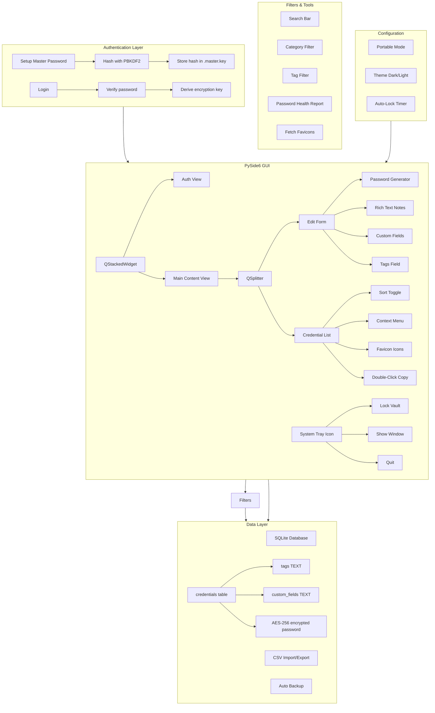
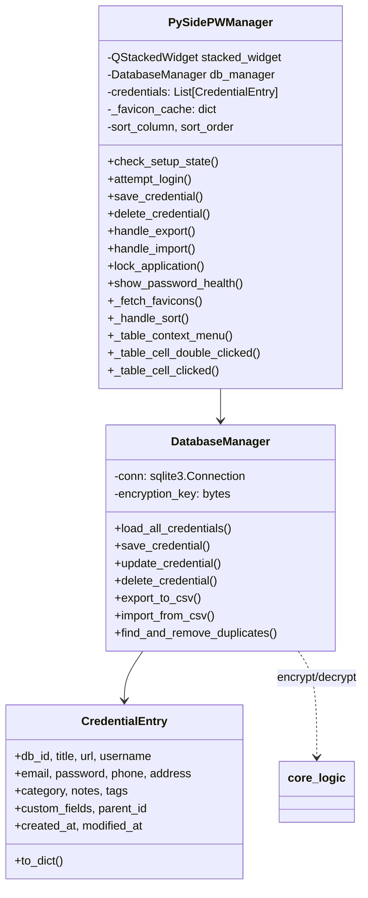

# docs — Technical Reference

> Auto-generated on 2026-07-24 15:27 CT from docs/sys/
> Source: `scripts/build_reference.py`

## Table of Contents

- [Architecture](#architecture)
- [Project Knowledge](#project-knowledge)
- [Project Plan](#project-plan)
- [Tasks](#tasks)
- [Changelog](#changelog)
- [Bug Tracker](#bug-tracker)
- [Development Costs](#development-costs)
- [Model Pricing Reference](#model-pricing-reference)
- [Diagram (aetherlock)](#diagram-(aetherlock))

---

---

## Architecture

## Directory Structure
```
AetherLock/
├── src/
│   ├── __init__.py            # Package init, PROJECT_ROOT constant
│   ├── core_logic.py          # Encryption, hashing, data model, settings
│   ├── db_manager.py          # SQLite CRUD, import/export, backup
│   ├── main.py                # Application entry point (QApplication setup)
│   └── gui/
│       ├── __init__.py
│       ├── app.py             # PySidePWManager — main window and UI logic
│       ├── dialogs.py         # PasswordGeneratorDialog, DocumentationDialog
│       └── theme.py           # Dark and light theme stylesheets
├── main_app_pyside.py         # Thin entry point (delegates to src.main.run)
├── help_doc.md                # Legacy user documentation
├── docs/
│   ├── USER_GUIDE.md          # Consolidated user documentation
│   └── sys/                   # System documentation (PLAN, ARCHITECTURE, etc.)
├── instructions/              # Prompt templates for AI workflow
├── scripts/                   # Utility scripts (build_reference, cost, etc.)
├── assets/                    # Application icon resources
├── .portable                  # Portable mode marker (created at runtime)
├── AGENTS.md                  # Agent instructions (READ ONLY)
├── aetherlock.spec           # PyInstaller build spec
├── .gitignore
├── .repomixignore
├── requirements.txt
├── password_manager.db        # Encrypted vault (SQLite)
├── password_manager.db.bak    # Auto-backup
├── .master.key                # Master password hash (PBKDF2)
└── .app_settings.json         # App settings (lockout, theme, etc.)
```

## Architecture Layers

### 1. Data Layer (`src/core_logic.py`, `src/db_manager.py`)
- SQLite database with AES-256 encrypted credential storage
- PBKDF2 key derivation from master password (600K iterations)
- Automatic versioned backups
- CSV import/export with encryption

### 2. Business Logic (`src/gui/app.py`)
- Authentication flow (setup master password → login → encryption key derivation)
- Clipboard management with auto-clear timer (15s)
- Auto-lock on inactivity (configurable 1-30 min)
- Password generation (via dialogs.py)
- Duplicate detection and removal
- System tray icon with quick-lock and minimize-to-tray
- Portable mode detection (.portable marker file)
- Category + tag filtering with dynamic dropdowns
- Password health report (weak/reused/short scan)
- Entry tags (comma-separated) and custom fields (JSON key/value pairs)
- Sort toggle on table columns (Title, Username, Category)
- Double-click to copy, right-click context menu
- Category click-to-filter from table cells
- Favicon auto-fetch from Google service
- Rich text notes with B/I/U formatting toolbar
- One-click timestamped backup

### 3. Presentation Layer (`src/gui/app.py`, `src/gui/dialogs.py`)
- PySide6 (Qt) GUI with QStackedWidget for auth/main views
- QSplitter with credential list (left) and edit form (right)
- Menu bar: File (export/import/backup/restore), Tools (duplicates), Settings (auto-lock, theme), Help
- Dark/light theme toggle in Settings menu

## Data Flow
```
User Input → PySidePWManager (app.py) → DatabaseManager (db_manager.py) → SQLite
                                                ↓
                                        core_logic.py (AES-256 encrypt/decrypt)
```

---

## Project Knowledge

> Read this first on session resume. Covers 80% of what you need to be
> productive without reading the full codebase. Updated every session.

---

## Architecture TL;DR

PySide6 desktop password manager. Single-window app with auth screen (setup/login)
and main split-pane view (credential list + edit form). SQLite backend with AES-256
encryption via `cryptography` library. Master password hashed with PBKDF2-SHA256.

## Critical Files Map

| File | Responsibility |
|------|---------------|
| `core_logic.py` | Encryption (Fernet/AES-256), password hashing, `CredentialEntry` model, settings JSON I/O |
| `db_manager.py` | SQLite CRUD for credentials, CSV import/export, duplicate removal, pre-op backup |
| `src/gui/app.py` | PySide6 GUI — auth flow, credential list/edit, clipboard mgmt, auto-lock, menus, system tray, health report, favicon fetch |
| `src/gui/dialogs.py` | PasswordGeneratorDialog, DocumentationDialog |
| `src/gui/theme.py` | Dark/light mode stylesheets, QPalette |
| `src/main.py` | QApplication entry point |
| `docs/USER_GUIDE.md` | User-facing documentation (opened from Help menu) |
| `aetherlock.spec` | PyInstaller spec for building standalone `.exe` |

## Key Decisions

| Decision | Rationale |
|----------|-----------|
| PySide6 (Qt) over Tkinter | Mature widget set, cross-platform, professional look |
| SQLite + AES-256 | Portable single-file vault, no server needed |
| PBKDF2 (600K iterations) | Industry-standard key derivation, OWASP recommended |
| QStackedWidget for views | Reliable view swapping between auth and main content |
| Single monolithic file | Legacy decision — scheduled for refactor into src/ package |

## Gotchas

- `WindowDeactivate` now resets activity timer (does NOT immediately lock) — fixed in session 4
- `sectionClicked` sort signal connected once in `create_main_content`, not on every `update_list_view`
- Password strength bar row is tracked independently via `row` counter to avoid grid cell collision
- Custom fields stored as JSON array of `{"field": "...", "value": "..."}` objects in `custom_fields` TEXT column
- Tags stored as comma-separated string in `tags` TEXT column — both columns auto-migrated on startup
- `handle_backup()` uses `get_timestamped_backup_path()` for unique filenames, shows success in status bar (no dialog)
- `.master.key` stores the hash, not the raw password — safe, but file deletion = permanent lockout
- Virtual env: `venv/` is a symlink → `kiss/`; both names resolve
- Portable mode: create `.portable` file in app directory to keep all data local
- System tray: close minimizes to tray; use File → Quit or tray → Quit to fully exit

## Code Patterns

- Database methods use `try/except` with `error_handler` callback (lambda wiring to QMessageBox)
- All passwords encrypted at rest, decrypted in memory during session
- `CredentialEntry.to_dict()` used for serialization
- `row_factory = sqlite3.Row` for named column access
- Lambda closures with default args for button callbacks: `lambda checked, entry=line_edit: ...`

## Navigation Hints

- **Need to change encryption?** → `core_logic.py` (encrypt_data, decrypt_data, derive_encryption_key)
- **Need to add a DB operation?** → `db_manager.py` (DatabaseManager class)
- **Need to change UI layout?** → `main_app_pyside.py` (PySidePWManager class)
- **Need to add a menu item?** → `main_app_pyside.py` (setup_menu_bar method)
- **Need to change backup behavior?** → `db_manager.py` (create_pre_op_backup, _auto_backup_db)

## Session History Summary

- **2026-07-24 (session 1)**: Initial project audit. Set up project scaffolding with New_Project_init template system. Created AGENTS.md, docs/sys/, USER_GUIDE.md, instructions/, scripts/, .repomixignore. Identified 3 bugs and 5 planned changes.
- **2026-07-24 (session 2)**: Fixed F0 (missing sys import), F1 (backup call order), F2 (assets dir). Refactored monolithic main_app_pyside.py (~1250 lines) into src/ package (7 files). Added dark/light theme support. Updated PyInstaller spec, .gitignore, requirements.txt.
- **2026-07-24 (session 3)**: Added system tray icon with quick-lock (A2). Added portable mode detection (A3). Created venv/ symlink (C3).
- **2026-07-24 (session 4)**: Category+tag filters, password health report, entry tags, custom fields, sort toggle, double-click copy, context menu, click-to-filter, favicon fetch, rich text notes, one-click backup. Fixed auto-lock timer bypass, strength bar grid collision, quit-to-tray bug, header clipping, RuntimeWarning. UI polish: QComboBox height matching, right-aligned labels, proportional form stretching, splitter sizing.

---

## Project Plan

# AetherLock Plan

## Legend
- C = Changes / Updates
- F = Bug
- A = Add

## ADDITIONS
- [x] A0 — Create `src/` directory, move source files into organized structure
- [x] A1 — Add dark/light theme toggle
- [x] A2 — Add system tray icon with quick-lock
- [x] A3 — Add portable mode detection and config
- [x] A4 — Category filter + tag filter dropdowns
- [x] A5 — Password health report dialog
- [x] A6 — Entry tags (DB column + form field + filter)
- [x] A7 — Custom fields (DB column + JSON + add/remove table)
- [x] A8 — Sort toggle on Title/Username/Category columns
- [x] A9 — Double-click to copy from table
- [x] A10 — Right-click context menu (Copy, Edit, Delete)
- [x] A11 — Category click-to-filter from table
- [x] A12 — Favicon auto-fetch (Google service)
- [x] A13 — Rich text notes with formatting toolbar
- [x] A14 — One-click timestamped backup

## BUGS
- [x] F0 — `resource_path()` references `sys._MEIPASS` without `sys` import at module level
- [x] F1 — `find_and_remove_duplicates()` calls backup before docstring (wrong execution order)
- [x] F2 — `assets/kiss_icon.ico` referenced but no `assets/` directory exists
- [x] F3 — Auto-lock triggers immediately on WindowDeactivate (bypasses configured timeout)
- [x] F4 — Password strength bar hidden by Email QLineEdit in same grid cell
- [x] F5 — File → Quit minimizes to tray instead of quitting
- [x] F6 — Header text clipped in credential table
- [x] F7 — `sectionClicked.disconnect()` RuntimeWarning on every table refresh

## CHANGES
- [x] C0 — Refactor `main_app_pyside.py`: split UI, controllers, clipboard, backup into separate modules
- [x] C1 — Replace `help_doc.md` with `docs/USER_GUIDE.md` in-app help reference
- [x] C2 — Update all file headers with proper Created/Last Edited/Purpose
- [x] C3 — Standardize virtual env to `venv/` (current is `kiss/`)
- [x] C4 — Move flat `.py` files into `src/` package structure
- [x] C5 — Form layout: right-aligned labels, 4px vertical spacing, proportional stretching
- [x] C6 — QComboBox styling: 30px height matching QLineEdit in both themes
- [x] C7 — Splitter: equal initial sizes, form panel capped at 700px

---

## Tasks

# AetherLock Tasks

## Legend
- C = Changes / Updates
- F = Bug
- A = Add

## P0 — Critical (security/stability)

- [x] F0 — Fix `resource_path()` missing `sys` import
  - **ID**: fix-resource-path
  - **Tags**: bug, gui, packaging
  - **Details**: `sys._MEIPASS` referenced but `sys` not imported at module level in `main_app_pyside.py`
  - **Files**: `main_app_pyside.py`
  - **Acceptance**: `resource_path()` works in both dev and PyInstaller builds without NameError

- [x] F1 — Fix `find_and_remove_duplicates()` backup call ordering
  - **ID**: fix-backup-order
  - **Tags**: bug, database
  - **Details**: `create_pre_op_backup()` called before docstring, making backup timing non-obvious and potentially mistimed
  - **Files**: `db_manager.py`
  - **Acceptance**: Backup is called at the correct point in the method body, not before the docstring

- [x] C0 — Refactor `main_app_pyside.py` into `src/` package structure
  - **ID**: refactor-src
  - **Tags**: refactor, architecture
  - **Details**: Split monolithic ~1250-line file into separate modules: engine.py (business logic), clipboard.py, gui/main_window.py, gui/dialogs/, data/database.py, data/encryption.py
  - **Files**: `main_app_pyside.py`, `core_logic.py`, `db_manager.py`
  - **Acceptance**: App launches and functions identically. Each module has single responsibility. No circular imports.

- [x] C1 — Update all file headers with standard format
  - **ID**: file-headers
  - **Tags**: chore, documentation
  - **Details**: Add `# Created`, `# Last Edited`, `# Path`, `# Purpose` headers to all Python files
  - **Files**: `core_logic.py`, `db_manager.py`, `main_app_pyside.py`
  - **Acceptance**: Every source file has proper header matching AGENTS.md standard

## P1 — Important (UX/Polish)

- [x] A2 — Add dark/light theme support
  - **ID**: theme-support
  - **Tags**: feature, gui
  - **Details**: Add theme toggle with dark and light mode, persistent setting
  - **Files**: `src/gui/app.py`, `src/gui/theme.py`
  - **Acceptance**: Full app respects dark/light theme, toggle in menu, persists across sessions

- [x] F2 — Create `assets/` directory with app icon
  - **ID**: fix-icon
  - **Tags**: bug, gui
  - **Details**: `assets/kiss_icon.ico` referenced but no directory exists
  - **Files**: `assets/`, `src/gui/app.py`
  - **Acceptance**: App icon displays correctly in title bar and taskbar

- [x] C2 — Replace `help_doc.md` with `docs/USER_GUIDE.md`
  - **ID**: help-to-userguide
  - **Tags**: change, documentation
  - **Details**: Update `DocumentationDialog` to load from `docs/USER_GUIDE.md` instead of `help_doc.md`
  - **Files**: `main_app_pyside.py`, `help_doc.md`, `docs/USER_GUIDE.md`
  - **Acceptance**: Help menu opens consolidated user guide

## P2 — Nice-to-have

- [x] C3 — Rename virtual env from `kiss/` to `venv/`
  - **ID**: fix-venv-name
  - **Tags**: chore, devx
  - **Details**: Standardize virtual environment name per template convention
  - **Files**: `.gitignore`
  - **Acceptance**: `venv/` is the active virtual environment

- [x] A2 — Add system tray icon with quick-lock
  - **ID**: tray-icon
  - **Tags**: feature, gui
  - **Details**: Minimize to tray, quick-lock from tray context menu
  - **Files**: `src/gui/app.py`
  - **Acceptance**: App minimizes to tray, tray menu has Lock and Quit options

- [x] A3 — Add portable mode detection and config
  - **ID**: portable-mode
  - **Tags**: feature, config
  - **Details**: `.portable` marker file keeps all data in app directory; toggle in Settings menu
  - **Files**: `src/__init__.py`, `src/gui/app.py`
  - **Acceptance**: Toggle in Settings, status bar shows [Portable] when active

- [x] A4 — Category filter + tag filter dropdowns
  - **ID**: filter-dropdowns
  - **Tags**: feature, ui
  - **Details**: QComboBox filters for category and tags next to search bar
  - **Files**: `src/gui/app.py`
  - **Acceptance**: Filters populate dynamically, combine with search text

- [x] A5 — Password health report dialog
  - **ID**: password-health
  - **Tags**: feature, tools
  - **Details**: Scans all entries for weak/reused/short passwords, shows in dialog with table
  - **Files**: `src/gui/app.py`
  - **Acceptance**: Tools → Password Health shows summary + detail table

- [x] A6 — Entry tags
  - **ID**: entry-tags
  - **Tags**: feature, database
  - **Details**: `tags TEXT` column auto-migrated, QLineEdit in form with comma-separated values
  - **Files**: `src/core_logic.py`, `src/db_manager.py`, `src/gui/app.py`
  - **Acceptance**: Tags save/load correctly, filter by tag works

- [x] A7 — Custom fields
  - **ID**: custom-fields
  - **Tags**: feature, database
  - **Details**: `custom_fields TEXT` column (JSON array), QTableWidget with add/remove in form
  - **Files**: `src/core_logic.py`, `src/db_manager.py`, `src/gui/app.py`
  - **Acceptance**: Custom fields save/load correctly as JSON

- [x] A8 — Sort toggle on Title/Username/Category
  - **ID**: sort-toggle
  - **Tags**: feature, ui
  - **Details**: Click column header to sort ascending, click again to toggle
  - **Files**: `src/gui/app.py`
  - **Acceptance**: Columns sort correctly in both directions

- [x] A9 — Double-click to copy from table
  - **ID**: double-click-copy
  - **Tags**: feature, ui
  - **Details**: Double-click any cell to copy value to clipboard with 15s auto-clear
  - **Files**: `src/gui/app.py`
  - **Acceptance**: Double-click copies cell text, status bar shows confirmation

- [x] A10 — Right-click context menu
  - **ID**: context-menu
  - **Tags**: feature, ui
  - **Details**: Right-click row for Copy Username, Copy Password, Edit, Delete
  - **Files**: `src/gui/app.py`
  - **Acceptance**: Context menu actions work correctly

- [x] A11 — Category click-to-filter
  - **ID**: click-to-filter
  - **Tags**: feature, ui
  - **Details**: Single-click category cell auto-sets category filter dropdown
  - **Files**: `src/gui/app.py`
  - **Acceptance**: Clicking category cell updates filter

- [x] A12 — Favicon auto-fetch
  - **ID**: favicon-fetch
  - **Tags**: feature, ui
  - **Details**: Tools → Fetch Favicons downloads 16×16 icons via Google service, displays in Title column
  - **Files**: `src/gui/app.py`
  - **Acceptance**: Favicons appear next to titles after fetch

- [x] A13 — Rich text notes
  - **ID**: rich-notes
  - **Tags**: feature, ui
  - **Details**: B/I/U formatting toolbar, stored as HTML
  - **Files**: `src/gui/app.py`
  - **Acceptance**: Notes save formatting, display correctly on reload

- [x] A14 — One-click timestamped backup
  - **ID**: one-click-backup
  - **Tags**: feature, ui
  - **Details**: Status bar message instead of modal dialog, unique filenames with timestamps
  - **Files**: `src/gui/app.py`
  - **Acceptance**: File → Backup saves to `kiss_vault_YYYY.MM.DD_HHMMSS.db.bak`

## P3 — Future

- [ ] Browser extension integration
- [ ] Cloud sync (optional, opt-in)
- [ ] Auto-type / fill hotkey

---

## Changelog

# Changelog

## 2026-07-24 (session 3)

### Added
- Project scaffolding with template system (AGENTS.md, docs/, instructions/, scripts/)
- System documentation: PLAN, ARCHITECTURE, KNOWLEDGE, TASKS, BUGS, COST, mermaid diagram
- `.repomixignore` for AI context management
- Template instructions for bug tracking, changelog, tasks, cost tracking
- `src/` package structure with proper module separation
- `src/gui/dialogs.py` — extracted PasswordGeneratorDialog and DocumentationDialog
- `src/gui/theme.py` — dark and light mode stylesheets
- `src/main.py` — clean application entry point
- `src/__init__.py` — PROJECT_ROOT constant for portable data paths
- `assets/` directory for application icon
- Dark/light theme toggle in Settings menu (persistent across sessions)
- In-app help now loads from consolidated `docs/USER_GUIDE.md`

### Changed
- Customized AGENTS.md for AetherLock (paths, critical files, database schema)
- Updated USER_GUIDE.md with actual application features and documentation
- Refactored monolithic `main_app_pyside.py` (~1250 lines) into `src/` package (7 files)
- Updated `aetherlock.spec` to use `src/main.py` as entry point and bundle `docs/`
- `main_app_pyside.py` is now a thin wrapper around `src.main.run()`
- Updated `.gitignore` to exclude app data files and both `kiss/` and `venv/` dirs
- Updated `requirements.txt` with actual runtime dependencies
- **C3**: Created `venv/` symlink → `kiss/` for standardized virtual env name

### Added
- **A3**: Portable mode detection and config — `.portable` marker file, toggle in Settings menu, status bar indicator
- **A2**: System tray icon with quick-lock — tray menu (Show Window, Lock Vault, Quit), minimize-to-tray on close

### Fixed
- **F0**: `resource_path()` missing `sys` import — added `import sys` at module level
- **F1**: `find_and_remove_duplicates()` backup call ordering — moved `create_pre_op_backup()` after docstring
- **F2**: Created `assets/` directory (icon optionally placed there, gracefully handled)

## 2026-07-24 (session 4)

### Added
- **Category filter** dropdown (QComboBox next to search) with dynamic population from credentials
- **Tag filter** dropdown — parses comma-separated tags, filters entries
- **Tag field** (`tags` TEXT column, auto-migrated) on the edit form
- **Custom fields** (`custom_fields` TEXT column, JSON array) with add/remove table UI
- **Password health report** (Tools menu) — scans weak/reused/short passwords with detail table
- **Sort toggle** — click Title/Username/Category column headers to sort ascending/descending
- **Double-click table cell to copy** — copies value to clipboard with 15s auto-clear
- **Right-click context menu** on table (Copy Username, Copy Password, Edit, Delete)
- **Category click-to-filter** — single-click a category cell to auto-set filter dropdown
- **Favicon auto-fetch** (Tools menu) — downloads 16×16 favicons from Google service, caches in-memory, displays in Title column
- **Rich text notes** — B/I/U formatting toolbar, stored as HTML
- **One-click backup** — status bar message instead of modal dialog, timestamped filenames

### Changed
- Auto-lock: `WindowDeactivate` now resets activity timer instead of immediately locking
- Table columns: increased default sizes (Title 220, Username 160, Category 140), minimum section 100px
- QComboBox styling: matched 30px height to QLineEdit in both themes
- Form labels right-aligned, grid vertical spacing set to 4px
- Splitter: equal initial sizes [500, 500], form panel capped at 700px max width
- Custom fields table: removed max-height cap, added stretch factor (1:2 with form grid)
- Sort signal moved to `create_main_content` (connected once, not on every refresh)

### Fixed
- Password strength bar: hidden by Email QLineEdit in same grid cell — fixed with independent row counter
- File → Quit minimized to tray instead of quitting — now calls `_quit_application()` directly
- Header text clipping in credential table — added `setFixedHeight(50)` on horizontal header
- `sectionClicked.disconnect()` RuntimeWarning — moved connection to table creation

---

## Bug Tracker

# AetherLock Bug Tracker

## F0 — `resource_path()` references `sys._MEIPASS` without module-level `sys` import

- **Status**: Fixed
- **Fixed**: 2026-07-24
- **Found**: 2026-07-24
- **Tags**: bug, gui, packaging
- **Description**: `resource_path()` in `main_app_pyside.py:58` uses `sys._MEIPASS` to resolve bundled asset paths in PyInstaller builds, but `sys` is only imported at the `__main__` block (line 1233), not at module level. This will cause a `NameError` in frozen builds.
- **Root Cause**: `import sys` is at line 1233 (`if __name__ == "__main__"` block) instead of the top of the file.
- **Fix**: Add `import sys` to the top-level imports in `main_app_pyside.py`.
- **Files**: `main_app_pyside.py`

## F1 — `find_and_remove_duplicates()` calls backup before docstring

- **Status**: Fixed
- **Fixed**: 2026-07-24
- **Found**: 2026-07-24
- **Tags**: bug, database
- **Description**: In `db_manager.py:244`, `self.create_pre_op_backup("Duplicate Removal")` is called on the line immediately after `def find_and_remove_duplicates(self):`, before the docstring and actual logic. While Python still executes this correctly (the docstring is a no-op string literal), the intent is confusing — the backup call looks like it belongs to the previous method or is misplaced.
- **Root Cause**: The `create_pre_op_backup` call was placed between the method signature and the docstring during a refactor, making the execution order non-obvious.
- **Fix**: Move `self.create_pre_op_backup("Duplicate Removal")` to after the docstring, at line ~256.
- **Files**: `db_manager.py`

## F2 — `assets/kiss_icon.ico` referenced but `assets/` directory does not exist

- **Status**: Fixed
- **Fixed**: 2026-07-24
- **Found**: 2026-07-24
- **Tags**: bug, gui
- **Description**: `main_app_pyside.py:252` attempts to load an icon from `assets/kiss_icon.ico`, but no `assets/` directory exists in the project. The error is silently caught and logged to console only.
- **Root Cause**: Icon file was planned but never created/committed.
- **Fix**: Create `assets/` directory with a valid `.ico` (or `.png`) application icon, or remove the icon reference. Update `aetherlock.spec` to bundle `assets/` if not already done.
- **Files**: `assets/kiss_icon.ico` (missing), `main_app_pyside.py`, `aetherlock.spec`

## F3 — Auto-lock triggers immediately on WindowDeactivate

- **Status**: Fixed
- **Fixed**: 2026-07-24
- **Found**: 2026-07-24
- **Tags**: bug, security, ui
- **Description**: `_check_focus_lock()` called `lock_application()` immediately on `WindowDeactivate`, bypassing the configured lockout timeout. Switching to another window (e.g., terminal) would lock the vault instantly regardless of the 3-minute setting.
- **Root Cause**: `eventFilter` called `_check_focus_lock()` on `WindowDeactivate`, which locked immediately if lockout was not set to "Never".
- **Fix**: Changed `WindowDeactivate` handler to call `reset_activity_timer()` instead of `_check_focus_lock()`. The configured timeout is now respected.
- **Files**: `src/gui/app.py`

## F4 — Password strength bar hidden by Email QLineEdit in grid cell

- **Status**: Fixed
- **Fixed**: 2026-07-24
- **Found**: 2026-07-24
- **Tags**: bug, ui
- **Description**: The `PasswordStrengthBar` was placed at grid row 4 column 1, but the Email QLineEdit was also at row 4 column 1 (due to `enumerate` indices). The QLineEdit overwrote the progress bar, making it invisible.
- **Root Cause**: Using `enumerate` for grid rows with an extra row inserted for the strength bar caused a cell collision.
- **Fix**: Replaced `enumerate` with an independent `row` counter that increments past the strength bar row (row += 1 inside the password block).
- **Files**: `src/gui/app.py`

## F5 — File → Quit minimizes to tray instead of quitting

- **Status**: Fixed
- **Fixed**: 2026-07-24
- **Found**: 2026-07-24
- **Tags**: bug, ui
- **Description**: File → Quit called `self.close()` which triggered `closeEvent` → minimize to tray. There was no way to actually quit the application from the menu.
- **Root Cause**: `closeEvent` always minimized to tray when tray icon was visible.
- **Fix**: Created `_quit_application()` that hides tray, runs cleanup, and calls `QApplication.quit()`. Both File → Quit and tray → Quit use this method.
- **Files**: `src/gui/app.py`

## F6 — Header text clipped in credential table

- **Status**: Fixed
- **Fixed**: 2026-07-24
- **Found**: 2026-07-24
- **Tags**: bug, ui
- **Description**: The horizontal header text in the credential table was partially visible, with words cut off at the edges. Increasing column widths or reducing padding didn't fully resolve it.
- **Root Cause**: The QHeaderView section height was determined by content and padding, but the minimum size wasn't enough for the bold 11pt font with 4px padding.
- **Fix**: Added `horizontalHeader().setFixedHeight(50)` to force adequate header height.
- **Files**: `src/gui/app.py`

## F7 — `sectionClicked.disconnect()` RuntimeWarning on every table refresh

- **Status**: Fixed
- **Fixed**: 2026-07-24
- **Found**: 2026-07-24
- **Tags**: bug, performance
- **Description**: Every call to `update_list_view()` tried to disconnect and reconnect the `sectionClicked` signal, producing a RuntimeWarning: "Failed to disconnect (None) from signal".
- **Root Cause**: Signal connection/disconnection happened in `update_list_view` (called on every credential change) instead of during table creation.
- **Fix**: Moved `h.sectionClicked.connect(self._handle_sort)` to `create_main_content` where the table is created once.
- **Files**: `src/gui/app.py`

---

## Development Costs

> Summary updated manually. Run `python scripts/update_cost.py` to append new sessions.

## AetherLock Project Cost

| Date | Timeline | Model | Cost |
|------|----------|-------|------|
| 2026-07-24 | 2026-07-24 (1 day) | DeepSeek V4 Flash | $0.00 |
| 2026-07-24 | 2026-07-24 (session 2-4) | DeepSeek V4 Flash | ~$0.15 |

## Cost Breakdown

| Date | Session | Model | Tokens In | Tokens Out | Cost |
|------|---------|-------|-----------|------------|------|
| 2026-07-24 | Project scaffolding & audit | DeepSeek V4 Flash | ~15,000 | ~8,000 | ~$0.004 |

---

## Model Pricing Reference

```
## Model Pricing Reference (as of 2026-07-24)

| Model | Input ($/M tokens) | Output ($/M tokens) |
|---|---|---|
| DeepSeek V4 Flash (off-peak) | $0.14 | $0.28 |
| DeepSeek V4 Flash (peak) | $0.28 | $0.56 |
| Gemini 2.5 Flash-Lite | $0.10 | $0.40 |
| Gemini 2.5 Flash | $0.25 | $1.00 |
| Ollama (local) | $0 (compute only) | $0 |

### Peak Hours
- DeepSeek peak: 9:00–12:00 & 14:00–18:00 Beijing time (UTC+8)
- Convert CT to Beijing: CT + 13 hours (CDT) or +14 (CST)

```

---

## Diagram (aetherlock)

```
                                  ┌─────────────────────────────────────┐
                                  │         MasterPasswordScreen        │
                                  ├─────────────────────────────────────┤          .master.key
                                  │ Setup new master password           │◄──────── (PBKDF2 hash)
                                  │ Verify & derive encryption key      │
                                  │ Login / Lock screen                 │
                                  └─────────────┬───────────────────────┘
                                                │ on success
                                                ▼
                ┌───────────────────────────────────────────────────────────────────────────┐
                │                              PySidePWManager                              │
                │  ┌──────────────────────────────┐    ┌─────────────────────────────────┐  │
                │  │        QStackedWidget         │    │  QSystemTrayIcon               │  │
                │  │  ├─ Auth View                 │    │  ├─ Show Window                │  │
                │  │  └─ Main Content View         │    │  ├─ Lock Vault                 │  │
                │  │                               │    │  └─ Quit                       │  │
                │  └──────────────────────────────┘    └─────────────────────────────────┘  │
                │                                                                           │
                │  ┌─────────────────────────────────────────────────────────────────────┐  │
                │  │                      QSplitter (Horizontal)                        │  │
                │  │  ┌──────────────────────────────┐  ┌─────────────────────────────┐  │  │
                │  │  │      Credential List (Left)   │  │      Edit Form (Right)      │  │  │
                │  │  ├──────────────────────────────┤  ├─────────────────────────────┤  │  │
                │  │  │ Search [___________]          │  │ Title: [_______________]    │  │  │
                │  │  │ Category [▼ All]  Tag [▼ All] │  │ URL:   [_______________]    │  │  │
                │  │  │ ┌────┬──────┬─────┬──────┐   │  │ Username: [_______________] │  │  │
                │  │  │ │Title│User │ URL │Cat. │   │  │ Password: [_________] [👁] │  │  │
                │  │  │ ├────┼──────┼─────┼──────┤   │  │           [Generate] [Copy]  │  │  │
                │  │  │ │     │      │     │      │   │  │           ████████░░ 80%      │  │  │
                │  │  │ │     │      │     │      │   │  │ Email:  [_______________]    │  │  │
                │  │  │ └────┴──────┴─────┴──────┘   │  │ Phone:  [_______________]    │  │  │
                │  │  │ [Add New] [Edit] [Delete]     │  │ Address:[_______________]    │  │  │
                │  │  │                               │  │ Category:[_______________]    │  │  │
                │  │  │ Sort: click header ▲/▼       │  │ Tags:   [tag1, tag2, tag3]   │  │  │
                │  │  │ Right-click: context menu     │  │ Notes:  [B] [I] [U]         │  │  │
                │  │  │ Double-click: copy cell       │  │          [________________]  │  │  │
                │  │  │ Click category: set filter    │  │          [________________]  │  │  │
                │  │  │ Favicon: ✓ in Title column    │  │ Custom Fields:              │  │  │
                │  │  └──────────────────────────────┘  │  │ ┌───────┬──────────────┐  │  │  │
                │  │                                    │  │ │ Field │ Value        │  │  │  │
                │  │                                    │  │ ├───────┼──────────────┤  │  │  │
                │  │                                    │  │ │ API   │ abc123       │  │  │  │
                │  │                                    │  │ └───────┴──────────────┘  │  │  │
                │  │                                    │  │ [+ Add] [- Remove]        │  │  │
                │  │                                    │  │ [Save] [Cancel]           │  │  │
                │  │                                    │  └─────────────────────────────┘  │  │
                │  └─────────────────────────────────────────────────────────────────────┘  │
                └───────────────────────────────────────────────────────────────────────────┘
                                            │
                                            ▼
                ┌───────────────────────────────────────────────────────────────────────────┐
                │                             DatabaseManager                               │
                │  ┌─────────────────────────────────────────────────────────────────────┐  │
                │  │  credentials table                                                    │  │
                │  │  db_id, title, url, username, email, password(encrypted), phone,     │  │
                │  │  address, category, notes, tags, custom_fields, parent_id,           │  │
                │  │  created_at, modified_at                                             │  │
                │  │                                                                      │  │
                │  │  ┌──────────────────────────────────────────────────────────────┐    │  │
                │  │  │  core_logic.py  encrypt_data() / decrypt_data() (Fernet/AES) │    │  │
                │  │  │  PBKDF2 key derivation (480K iterations)                     │    │  │
                │  │  │  CredentialEntry data model                                  │    │  │
                │  │  └──────────────────────────────────────────────────────────────┘    │  │
                │  └─────────────────────────────────────────────────────────────────────┘  │
                │                                                                           │
                │  ┌─────────────────────────────────────────────────────────────────────┐  │
                │  │  Tools & Features                                                    │  │
                │  │  ├─ CSV Import / Export                                              │  │
                │  │  ├─ Timestamped Auto-Backup (on save, shutdown)                      │  │
                │  │  ├─ Manual Backup (1-click, timestamped filename)                    │  │
                │  │  ├─ Password Health Report (weak/reused/short scan)                  │  │
                │  │  ├─ Fetch Favicons (Google service, cached in-memory)                │  │
                │  │  ├─ Find & Remove Duplicates (title+username match)                  │  │
                │  │  └─ Password Generator (length 8-64, char set options)               │  │
                │  └─────────────────────────────────────────────────────────────────────┘  │
                │                                                                           │
                │  ┌─────────────────────────────────────────────────────────────────────┐  │
                │  │  Configuration                                                        │  │
                │  │  ├─ Theme: Dark / Light (persistent in .app_settings.json)            │  │
                │  │  ├─ Auto-Lock: 1/3/5/10/30 min or Never                             │  │
                │  │  ├─ Clipboard: auto-clear after 15s                                 │  │
                │  │  └─ Portable Mode: data stays in app directory (.portable marker)    │  │
                │  └─────────────────────────────────────────────────────────────────────┘  │
                └───────────────────────────────────────────────────────────────────────────┘

------------------


 +------------------------------------------------------+
 | Auth["Authentication Layer"]                         |
 |                                                      |
 |                                                      |
 | +----------------------+    +----------------------+ |      +----------------------+        +----------------------+
 | |                      |    |                      | |      |                      |        |                      |
 | |     Setup Master     |    |        Login         | |      |         Auth         |        |        Config        |
 | |       Password       |    |                      | |      |                      |        |                      |
 | |                      |    |                      | |      |                      |        |                      |
 | +----------------------+    +----------------------+ |      +----------------------+        +----------------------+
 |             |                           |            |                 |                                |
 |             |                           |            |                 |                                |
 |             |                           |            |                 | +------------------------------+
 |             |                           |            |                 | |
 |             v                           v            |                 v v
 | +----------------------+    +----------------------+ |      +----------------------+
 | |                      |    |                      | |      |                      |
 | |   Hash with PBKDF2   |    |   Verify password    | |      |          UI          |
 | |                      |    |                      | |      |                      |
 | +----------------------+    +----------------------+ |      +----------------------+
 |             |                           |            |                  |
 |             |                           |            |                  |
 |             |                           |            |                  +---------------+
 |             |                           |            |                  |               |
 |             v                           v            |                  v               |
 | +----------------------+    +----------------------+ |      +----------------------+    |
 | |                      |    |                      | |      |                      |    |
 | |    Store hash in     |    |  Derive encryption   | |      |       Filters        |    |
 | |     .master.key      |    |         key          | |      |                      |    |
 | |                      |    |                      | |      |                      |    |
 | +----------------------+    +----------------------+ |      +----------------------+    |
 |                                                      |                 |                |
 +------------------------------------------------------------------------|----------------|----------------------------------------------------------------------------------------------------------------------------------------------------+
 | UI["PySide6 GUI"]                                                      | +--------------+                                                                                                                                                    |
 |                                                                        | |                                                                                                                                                                   |
 |                                                                        v v                                                                                                                                                                   |
 | +----------------------+    +----------------------+        +----------------------+                                                                                                                                                         |
 | |                      |    |                      |        |                      |                                                                                                                                                         |
 | |    QStackedWidget    |    |   System Tray Icon   |        |         Data         |                                                                                                                                                         |
 | |                      |    |                      |        |                      |                                                                                                                                                         |
 | +----------------------+    +----------------------+        +----------------------+                                                                                                                                                         |
 |             |                           |                                                                                                                                                                                                    |
 |             |                           |                                                                                                                                                                                                    |
 |             +---------------------------|-------------------------------+                                                                                                                                                                    |
 |             |                           |                               |                                                                                                                                                                    |
 |             |                           |                               |                                                                                                                                                                    |
 |             |                           |                               |                                                                                                                                                                    |
 |             |                           |                               |                                                                                                                                                                    |
 |             |                           |---------------------------------------------------------------+                                                                                                                                    |
 |             |                           |                               |                               |                                                                                                                                    |
 |             |                           |                               |                               |                                                                                                                                    |
 |             |                           |                               |                               |                                                                                                                                    |
 |             |                           |                               |                               |                                                                                                                                    |
 |             |                           +-----------------------------------------------------------------------------------------------+                                                                                                    |
 |             |                           |                               |                               |                               |                                                                                                    |
 |             |                           |                               |                               |                               |                                                                                                    |
 |             |                           |                               |                               |                               |                                                                                                    |
 |             |                           |                               |                               |                               |                                                                                                    |
 |             |                           |                               |                               |                               |                                                                                                    |
 |             |                           |                               |                               |                               |                                                                                                    |
 |             v                           v                               v                               v                               v                                                                                                    |
 | +----------------------+    +----------------------+        +----------------------+        +----------------------+        +----------------------+                                                                                         |
 | |                      |    |                      |        |                      |        |                      |        |                      |                                                                                         |
 | |      Auth View       |    |  Main Content View   |        |      Lock Vault      |        |     Show Window      |        |         Quit         |                                                                                         |
 | |                      |    |                      |        |                      |        |                      |        |                      |                                                                                         |
 | +----------------------+    +----------------------+        +----------------------+        +----------------------+        +----------------------+                                                                                         |
 |                                         |                                                                                                                                                                                                    |
 |             +---------------------------+                                                                                                                                                                                                    |
 |             v                                                                                                                                                                                                                                |
 | +----------------------+                                                                                                                                                                                                                     |
 | |                      |                                                                                                                                                                                                                     |
 | |      QSplitter       |                                                                                                                                                                                                                     |
 | |                      |                                                                                                                                                                                                                     |
 | +----------------------+                                                                                                                                                                                                                     |
 |             |                                                                                                                                                                                                                                |
 |             +---------------------------+                                                                                                                                                                                                    |
 |             v                           v                                                                                                                                                                                                    |
 | +----------------------+    +----------------------+                                                                                                                                                                                         |
 | |                      |    |                      |                                                                                                                                                                                         |
 | |   Credential List    |    |      Edit Form       |                                                                                                                                                                                         |
 | |                      |    |                      |                                                                                                                                                                                         |
 | +----------------------+    +----------------------+    +-----------------------------------------------------------------------------------------------------------------------------------------------------------------------+            |
 |             |                           |               |                                                                                                                                                                       |            |
 |             |---------------+           +---------------+---------------------------------------------------------------------------------------------------------------+                                                       |            |
 |             |               |           |                                                                                                                               |                                                       |            |
 |             |               |           |                                                                                                                               |                                                       |            |
 |             |-------------+ |           |-----------------------------------------------------------------------------------------------+                               |                                                       |            |
 |             |             | |           |                                                                                               |                               |                                                       |            |
 |             |             | |           |                                                                                               |                               |                                                       |            |
 |             +----------+  | |           |                                                                                               |                               |                                                       |            |
 |             |          |  | |           |                                                                                               |                               |                                                       |            |
 |             |          |  | |           |                                                                                               |                               |                                                       |            |
 |             |          |  | |           |                                                                                               |                               |                                                       |            |
 |             |          |  | |           |                                                                                               |                               |                                                       |            |
 |             |          |  | |           |                                                                                               |                               |                                                       |            |
 |             |          |  | |           +-----------------------------------------------------------------------------------------------------------------------------------------------------------+                           |            |
 |             |          |  | |                                                                                                           |                               |                           |                           |            |
 |             |          |  | |                                                                                                           |                               |                           |                           |            |
 |             |          |  +---------------------------------------------+                                                               |                               |                           |                           |            |
 |             |          |    |                                           |                                                               |                               |                           |                           |            |
 |             |          |    |                                           |                                                               |                               |                           |                           |            |
 |             |          +--------------------------------------------------------------------------------+                               |                               |                           |                           |            |
 |             v                           v                               v                               v                               v                               v                           v                           v            |
 | +----------------------+    +----------------------+        +----------------------+        +----------------------+        +----------------------+        +----------------------+    +----------------------+    +----------------------+ |
 | |                      |    |                      |        |                      |        |                      |        |                      |        |                      |    |                      |    |                      | |
 | |     Sort Toggle      |    |     Context Menu     |        |    Favicon Icons     |        |  Double-Click Copy   |        |  Password Generator  |        |   Rich Text Notes    |    |    Custom Fields     |    |      Tags Field      | |
 | |                      |    |                      |        |                      |        |                      |        |                      |        |                      |    |                      |    |                      | |
 | +----------------------+    +----------------------+        +----------------------+        +----------------------+        +----------------------+        +----------------------+    +----------------------+    +----------------------+ |
 |                                                                                                                                                                                                                                              |
 +----------------------------------------------------------------------------------------------------------------------------------------------------------------------------------------------------------------------------------------------+


 +------------------------------------------------------------------------------------------------------------------------------------------------------+
 | UI2["Filters & Tools"]                                                                                                                               |
 |                                                                                                                                                      |
 |                                                                                                                                                      |
 | +----------------------+    +----------------------+        +----------------------+        +----------------------+        +----------------------+ |
 | |                      |    |                      |        |                      |        |                      |        |                      | |
 | |      Search Bar      |    |   Category Filter    |        |      Tag Filter      |        |   Password Health    |        |    Fetch Favicons    | |
 | |                      |    |                      |        |                      |        |        Report        |        |                      | |
 | |                      |    |                      |        |                      |        |                      |        |                      | |
 | +----------------------+    +----------------------+        +----------------------+        +----------------------+        +----------------------+ |
 |                                                                                                                                                      |
 +------------------------------------------------------------------------------------------------------------------------------------------------------+


 +--------------------------------------------------------------------------------------+
 | Config["Configuration"]                                                              |
 |                                                                                      |
 |                                                                                      |
 | +----------------------+    +----------------------+        +----------------------+ |
 | |                      |    |                      |        |                      | |
 | |    Portable Mode     |    |   Theme Dark/Light   |        |   Auto-Lock Timer    | |
 | |                      |    |                      |        |                      | |
 | +----------------------+    +----------------------+        +----------------------+ |
 |                                                                                      |
 +--------------------------------------------------------------------------------------+


 +----------------------------------------------------------------------------------------------------------------------+
 | Data["Data Layer"]                                                                                                   |
 |                                                                                                                      |
 |                                                                                                                      |
 | +----------------------+    +----------------------+        +----------------------+        +----------------------+ |
 | |                      |    |                      |        |                      |        |                      | |
 | |   SQLite Database    |    |  credentials table   |        |  CSV Import/Export   |        |     Auto Backup      | |
 | |                      |    |                      |        |                      |        |                      | |
 | +----------------------+    +----------------------+        +----------------------+        +----------------------+ |
 |                                         |                                                                            |
 |                                         +-------------------------------+                                            |
 |                                         |                               |                                            |
 |                                         |                               |                                            |
 |             +---------------------------|                               |                                            |
 |             v                           v                               v                                            |
 | +----------------------+    +----------------------+        +----------------------+                                 |
 | |                      |    |                      |        |                      |                                 |
 | |      tags TEXT       |    |  custom_fields TEXT  |        |  AES-256 encrypted   |                                 |
 | |                      |    |                      |        |       password       |                                 |
 | |                      |    |                      |        |                      |                                 |
 | +----------------------+    +----------------------+        +----------------------+                                 |
 |                                                                                                                      |
 +----------------------------------------------------------------------------------------------------------------------+




          +-------------------------------------+
          |           PySidePWManager           |
          +-------------------------------------+
          | -QStackedWidget stacked_widget      |
          | -DatabaseManager db_manager         |
          | -credentials: List[CredentialEntry] |
          | -_favicon_cache: dict               |
          | -sort_column, sort_order            |
          +-------------------------------------+
          | +check_setup_state()                |
          | +attempt_login()                    |
          | +save_credential()                  |
          | +delete_credential()                |
          | +handle_export()                    |
          | +handle_import()                    |
          | +lock_application()                 |
          | +show_password_health()             |
          | +_fetch_favicons()                  |
          | +_handle_sort()                     |
          | +_table_context_menu()              |
          | +_table_cell_double_clicked()       |
          | +_table_cell_clicked()              |
          +-------------------------------------+
                             |
                             |
                             |
                             >
             +-------------------------------+
             |        DatabaseManager        |
             +-------------------------------+
             | -conn: sqlite3.Connection     |
             | -encryption_key: bytes        |
             +-------------------------------+
             | +load_all_credentials()       |
             | +save_credential()            |
             | +update_credential()          |
             | +delete_credential()          |
             | +export_to_csv()              |
             | +import_from_csv()            |
             | +find_and_remove_duplicates() |
             +-------------------------------+
                            | :
                    |-------- :
                    |         :
                    >         ............encrypt/decrypt
  +----------------------------------+            :
  |         CredentialEntry          |            :
  +----------------------------------+            :
  | +db_id, title, url, username     |            >
  | +email, password, phone, address |    +--------------+
  | +category, notes, tags           |    |  core_logic  |
  | +custom_fields, parent_id        |    +--------------+
  | +created_at, modified_at         |
  +----------------------------------+
  | +to_dict()                       |
  +----------------------------------+



```

---

*Generated on 2026-07-24 15:27 CT by `scripts/build_reference.py`*